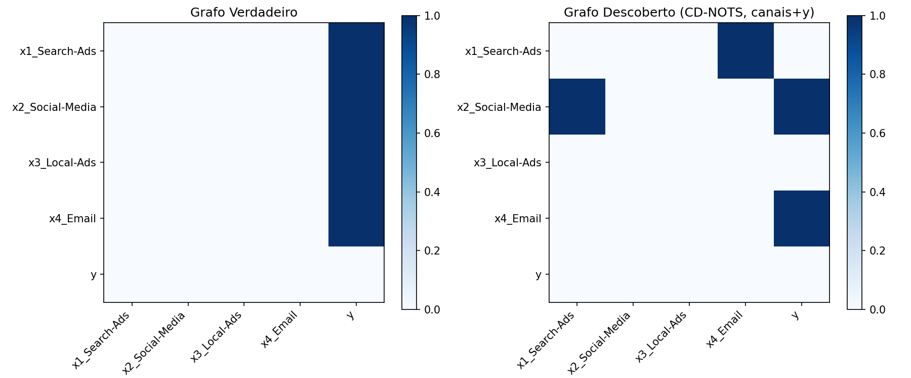
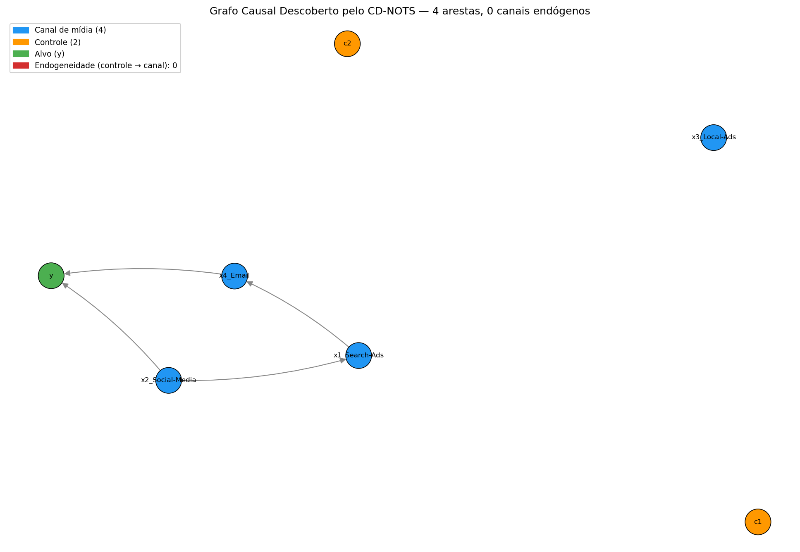
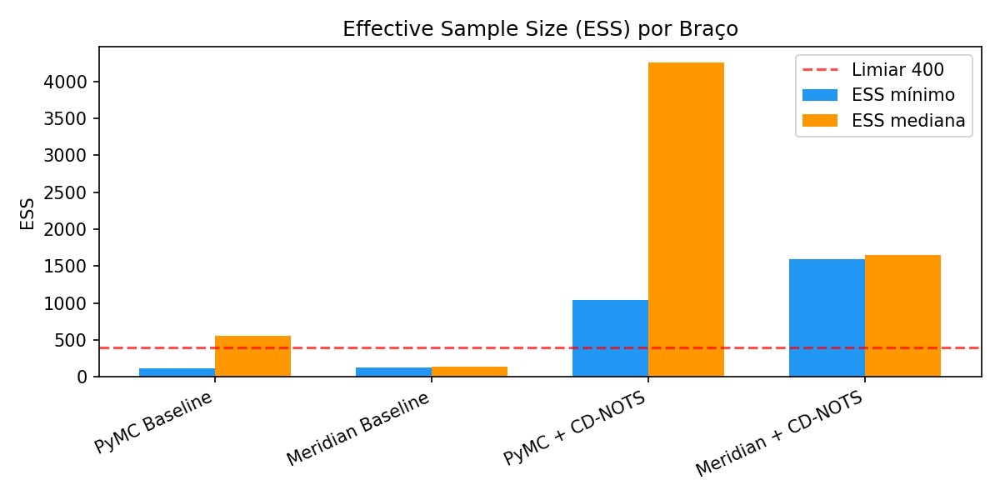
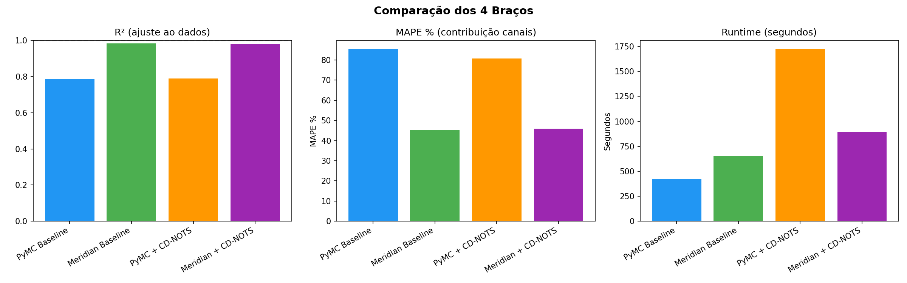
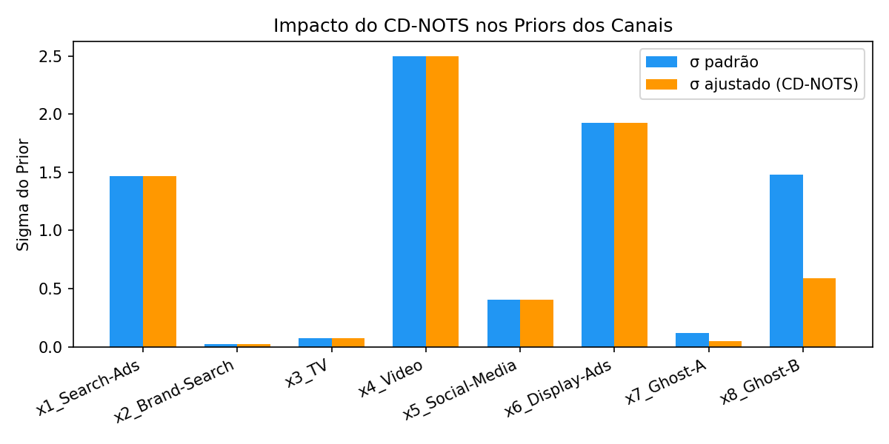
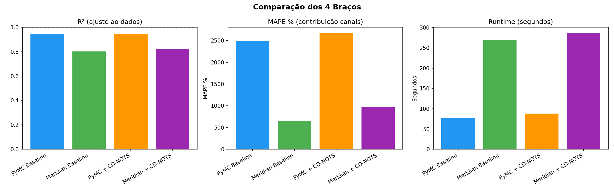
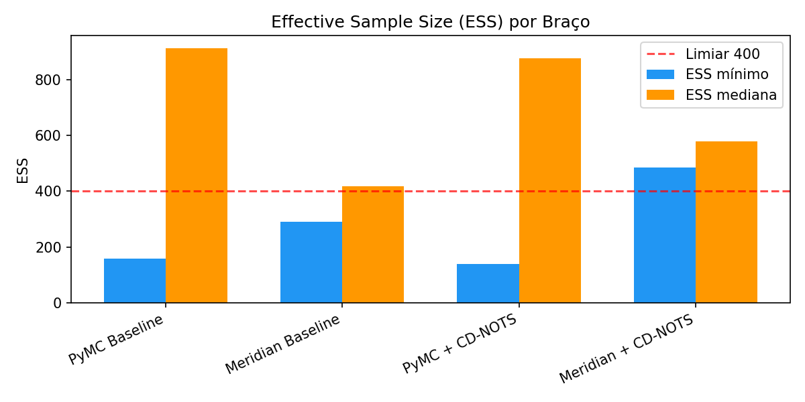
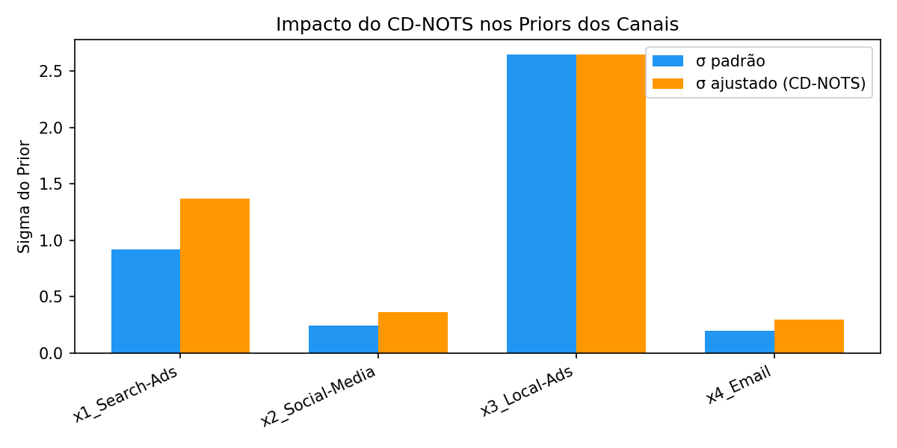

# Universidade Presbiteriana Mackenzie

## Programa de Pós-Graduação em Computação Aplicada

**Rafael Silva Ennes**

# Investigação da Utilização de Descoberta de Estruturas Causais para Calibração de Modelos Bayesianos em Marketing Mix Modeling

São Paulo
2026

---

# Resumo

O Marketing Mix Modeling (MMM) é uma técnica amplamente utilizada para avaliar a eficácia de investimentos em diferentes canais de mídia e orientar decisões de alocação orçamentária. Os frameworks Bayesianos dominantes — PyMC-Marketing e Google Meridian — dependem de estruturas causais especificadas manualmente e priors calibrados por experimentos de incrementalidade, recursos inacessíveis à maioria das organizações. Paralelamente, abordagens de descoberta causal baseadas em redes neurais (CausalMMM) demonstram capacidade de identificar estruturas causais automaticamente, mas requerem volumes de dados (N > 100 entidades geográficas) incompatíveis com a realidade de mercados que operam com estratégias nacionais, como o brasileiro. Esta pesquisa propõe e avalia uma abordagem intermediária: a utilização do algoritmo CD-NOTS (Constraint-based Causal Discovery from Nonstationary Time-Series) para descoberta automática de grafos causais entre canais de marketing, e a tradução desses grafos em priors estruturais para calibração de modelos Bayesianos de MMM. O pipeline proposto — descoberta causal → tradução para priors → modelagem Bayesiana — é avaliado em design experimental de 4 braços comparando PyMC-Marketing e Meridian com e sem calibração via CD-NOTS, utilizando dados sintéticos com ground truth conhecido. Até onde sabemos, esta é a primeira proposta de integrar descoberta causal algorítmica baseada em testes de independência condicional como mecanismo de calibração estrutural de priors em modelos Bayesianos de Marketing Mix Modeling.

**Palavras-chave:** Marketing Mix Modeling; Descoberta Causal; CD-NOTS; Inferência Bayesiana; Priors Estruturais; PyMC-Marketing; Meridian.

---

# Abstract

[Versão em inglês do resumo — a ser redigida]

---

# Sumário

1. Contexto
2. Problema
3. Público-alvo
4. Fundamentação Teórica
   - 4.1 Marketing Mix Modeling: Origens, Conceitos e Evolução
   - 4.2 Efeitos Temporais e Não-Lineares em Marketing
   - 4.3 Frameworks Bayesianos para MMM
   - 4.4 Descoberta Causal em Séries Temporais
   - 4.5 Complementaridade entre Métodos Observacionais e Experimentais
5. Soluções Existentes (Technology Road Map)
   - 5.1 Estado da Prática: Frameworks Open-Source
   - 5.2 Estado da Arte: Descoberta Causal Aplicada a MMM
   - 5.3 Lacuna Identificada
6. Solução Proposta
   - 6.1 Pipeline: Descoberta Causal → Priors Estruturais → Modelagem Bayesiana
   - 6.2 Design Experimental de 4 Braços
   - 6.3 Métricas de Avaliação
7. Desenvolvimento (MVP)
   - 7.1 Módulo de Descoberta Causal (CD-NOTS)
   - 7.2 Módulo de Calibração de Priors (Empirical Bayes)
   - 7.3 Geração do Dataset com Estrutura Causal Conhecida
   - 7.4 Framework de Benchmark
8. Validação
9. Resultados
10. Impactos
11. Plano de Exploração da Tecnologia
12. Artefatos Tecnológicos Gerados
13. Publicações
14. Referências

---

# 1. Contexto

## 1.1 Investimentos em Marketing e a Necessidade de Mensuração Causal

As organizações contemporâneas alocam recursos financeiros substanciais em atividades de marketing, demandando instrumentos metodológicos rigorosos para quantificar o retorno desses investimentos. Segundo Hanssens (2024), o Return on Marketing Investment (ROMI) apresenta variação dramática conforme os níveis de investimento, comportamento atribuível aos padrões não-lineares que caracterizam a resposta das métricas de marketing às mudanças nos gastos alocados. Esta constatação revela que a relação entre investimento de marketing e resultado financeiro não segue função linear simplificada, exigindo modelagem estatística sofisticada para capturar adequadamente a dinâmica de resposta mercadológica.

A urgência em demonstrar o valor econômico do marketing consolidou-se como imperativo estratégico nas organizações modernas. Morgan et al. (2022) documentam que 83% dos líderes de marketing identificam a demonstração de ROI como prioridade máxima em suas agendas corporativas. Este dado evidencia não apenas uma preocupação corporativa isolada, mas sim uma tendência sistêmica onde a comprovação da efetividade do marketing torna-se condição essencial para justificar alocações orçamentárias e garantir continuidade de investimentos mercadológicos.

## 1.2 Limitações das Métricas Isoladas e Emergência da Mensuração Triangular

A utilização de métricas isoladas revela-se insuficiente para capturar a complexidade multidimensional do impacto mercadológico. Hanssens & Pauwels (2016) demonstram que métricas atitudinais, comportamentais e financeiras apresentam correlações fracas entre si, sugerindo que nenhuma dimensão isolada fornece representação adequada do fenômeno de interesse.

A fragilidade das abordagens unimodais de mensuração conduziu à emergência de frameworks integrados. Van der Weide et al. (2020) demonstraram empiricamente que a integração de Marketing Mix Modeling (MMM), Marketing Technology Attribution (MTA) e testes de incrementalidade em framework unificado produz aumento de 40% no uplift esperado comparativamente à utilização isolada de MTA.

Consequentemente, a evolução do pensamento em mensuração de marketing migra de paradigma fundado em métricas compartimentalizadas para paradigma fundamentado em triangulação metodológica sistemática. A convergência de evidências provenientes de múltiplas abordagens analíticas fornece fundação mais sólida para inferência causal e alocação de recursos.

## 1.3 MMM como Solução Comprovada

A transição conceitual de despesa para investimento em marketing fundamenta-se na evidência empírica de que ações mercadológicas geram efeitos persistentes que transcendem períodos imediatos de execução. Dekimpe & Hanssens (1995, 1999) estabeleceram que marketing cria efeitos persistentes em vendas. MMM captura efeitos de longo prazo, retornos decrescentes e sinergias entre canais que MTA não consegue mensurar.

A sinergia entre canais — por exemplo, aumento de efetividade da publicidade digital quando acompanhada de investimentos em branding tradicional — representa fonte significativa de impacto que permanece invisível em abordagens baseadas em atribuição de último touchpoint, introduzindo viés sistemático nas estimativas de efetividade individual de canais.

## 1.4 Democratização através de Frameworks Open-Source

Jin et al. (2017) estabeleceram fundações teóricas com transformações adstock e Hill. Meta lançou Robyn (2020), Google lançou LightweightMMM (2022) e Meridian (2024), democratizando técnicas anteriormente proprietárias. A disponibilização de frameworks open-source representa transição fundamental na estrutura de conhecimento de MMM, migrando de paradigma concentrado em propriedade intelectual corporativa para paradigma fundamentado em colaboração técnica aberta.

## 1.5 Superioridade de Métodos Bayesianos para Contextos de Marketing

Rossi & Allenby (2003) estabeleceram vantagens Bayesianas: modularidade, incorporação de conhecimento prévio, quantificação de incerteza. Wang et al. (2017) demonstraram como pooling hierárquico de dados de categoria melhora estimativas com amostras pequenas. Chen et al. (2021) demonstram que codificar conhecimento de domínio como restrições de sinal em priors Bayesianos melhora a qualidade da estimação.

A superioridade dos métodos Bayesianos em contexto de MMM representa alinhamento fundamental entre estrutura do paradigma estatístico e característica da realidade mercadológica que busca modelar.

## 1.6 Fronteira: Integração de Causalidade através de DAGs e Estruturas Aprendidas

CausalMMM (GONG et al., 2024) demonstra melhorias de 5,7-7,1% em AUROC descobrindo estruturas causais automaticamente usando Graph VAE. DeepCausalMMM (TIRUMALA, 2025) combina GRUs com DAG learning para padrões temporais complexos. Filippou et al. (2025) aplicam PCMCI a dados agregados de marketing, demonstrando atribuição causal viável sem dados de nível de usuário. Estas contribuições inauguram a aplicação direta de descoberta causal a dados de marketing, mas deixam em aberto a questão de como integrar grafos descobertos com os frameworks Bayesianos já estabelecidos na prática.

---

# 2. Problema

## 2.1 O Gap entre Descoberta Causal e Modelagem Bayesiana em MMM

Os frameworks Bayesianos dominantes (PyMC-Marketing, Meridian) assumem uma estrutura causal fixa e pré-definida pelo analista: canais → vendas, sem interações entre canais. O que os torna "causais" na narrativa do mercado é que os priors são calibrados a partir de experimentos de incrementalidade. Porém, como documentado por Zhang et al. (2024) do Google, Lewis & Rao (2015) no QJE, e Gordon et al. (2019) no Marketing Science, a calibração experimental enfrenta limitações severas: custo combinatório O(d²) para mapear todas as relações entre d canais, natureza estática dos resultados, incapacidade de capturar mediação inter-canal, e inacessibilidade para a maioria das organizações.

Paralelamente, métodos de descoberta causal baseados em redes neurais (CausalMMM, DeepCausalMMM) demonstram capacidade de descobrir estruturas causais automaticamente, mas são frameworks end-to-end de deep learning que **substituem** modelos Bayesianos em vez de **melhorá-los**. Além disso, conforme documentado por Gong et al. (2024, Figura 4), esses modelos apresentam degradação significativa de performance com N < 100 entidades — limitação crítica para sua adoção prática.

## 2.2 O Problema de Low-N e a Inviabilidade de Redes Neurais no Contexto Brasileiro

O CausalMMM foi validado com dados de plataformas de e-commerce chinesas (Alibaba), onde a heterogeneidade entre centenas de "shops" fornece variação suficiente para o Graph VAE aprender estruturas causais diferenciadas. Em mercados com distribuição geográfica ampla — como os Estados Unidos, com 50+ estados ou 200+ DMAs (Designated Market Areas) — a modelagem geo-level multiplica os datapoints disponíveis, viabilizando abordagens de deep learning.

No entanto, esta não é a realidade da maioria dos mercados. No Brasil, a grande maioria das empresas opera com **estratégias de mídia nacionais**: o mesmo investimento em TV aberta, as mesmas campanhas digitais, distribuídos uniformemente pelo território. Não há variação geo-level significativa para explorar. Uma empresa brasileira típica dispõe de 104-208 semanas de dados semanais com 1 geo (nacional) ou no máximo 5 regiões (Sul, Sudeste, Centro-Oeste, Nordeste, Norte) — totalizando 104-1040 observações. Este volume é insuficiente para treinar um Graph VAE com as arquiteturas propostas por Gong et al. (2024) ou Tirumala (2025).

Este cenário representa um problema mais amplo do que o caso brasileiro: qualquer mercado onde a estratégia de mídia é predominantemente nacional (muitos países europeus menores, mercados asiáticos não fragmentados geograficamente) enfrenta a mesma limitação. O avanço científico em descoberta causal via redes neurais corre o risco de permanecer restrito a contextos com abundância de dados geo-level — uma fração minoritária dos cenários reais de aplicação de MMM.

## 2.3 Formulação do Problema

Diante deste cenário, o problema de pesquisa pode ser formulado como:

**É possível melhorar a especificação de modelos Bayesianos de MMM (PyMC-Marketing, Meridian) utilizando grafos causais descobertos algoritmicamente via testes de independência condicional (CD-NOTS) como priors estruturais, em contextos de dados com poucos datapoints (low-N) onde abordagens de deep learning são inviáveis?**

Este problema desdobra-se em três questões específicas:

1. O CD-NOTS consegue descobrir estruturas causais informativas entre canais de marketing a partir de séries temporais com 104-208 observações?
2. A tradução do grafo causal descoberto em ajustes de priors Bayesianos melhora as métricas preditivas e de atribuição dos modelos PyMC-Marketing e Meridian?
3. Qual o ganho marginal da descoberta causal sobre os modelos baseline, e em quais cenários esse ganho é mais pronunciado?

---

# 3. Público-alvo

O artefato tecnológico desenvolvido nesta pesquisa destina-se a três públicos:

**Praticantes de MMM em empresas e agências:** Profissionais que utilizam PyMC-Marketing ou Meridian para modelagem de mix de marketing e buscam melhorar a especificação de seus modelos sem depender exclusivamente de experimentos de incrementalidade. O pipeline proposto é modular e integrável aos workflows existentes.

**Pesquisadores em inferência causal aplicada a marketing:** Acadêmicos e cientistas de dados interessados na interseção entre descoberta causal em séries temporais e modelagem Bayesiana. A pesquisa contribui com o primeiro benchmark comparativo de modelos Bayesianos de MMM com e sem calibração por descoberta causal.

**Gestores de marketing em mercados com dados limitados:** Decisores em organizações que operam com estratégias nacionais (poucos geos) e não dispõem de infraestrutura para geo-lift tests, mas necessitam de instrumentos quantitativos para alocação orçamentária fundamentada em causalidade.

---

# 4. Fundamentação Teórica

## 4.1 Marketing Mix Modeling: Origens, Conceitos e Evolução

[INSERIR CONTEÚDO EXISTENTE DO WIP — Seções 2.1 a 2.3]

O Marketing Mix Modeling (MMM) é uma técnica estatística que visa medir e quantificar o impacto de diferentes atividades e investimentos de marketing sobre indicadores de negócio como vendas, receita e volume de mercadoria (BERMAN, 2018; CHAN et al., 2017). Diferentemente de modelos de atribuição determinísticos, que rastreiam o percurso individual do cliente através dos pontos de contato, o MMM trabalha com dados agregados e utiliza técnicas econométricas para isolar o efeito de cada variável de marketing mantendo outras constantes.

### 4.1.1 Origens do Conceito de Marketing Mix

O conceito de Marketing Mix tem suas raízes na década de 1940, quando Culliton (1948, apud BORDEN, 1964) mencionou pela primeira vez a ideia de "mix de marketing". Neil Borden popularizou o termo em 1964, propondo um framework com 12 elementos componentes. A simplificação mais influente veio com McCarthy (1960, 1964), que consolidou os elementos nos famosos 4Ps: Product, Price, Place e Promotion, termos amplamente divulgados por Kotler (1967).

### 4.1.2 Modelos Econométricos Pioneiros

O desenvolvimento de modelos quantitativos para medir resposta de vendas à publicidade marca ponto de inflexão na história do marketing científico. O modelo de Vidale e Wolfe (1957) aplicou pesquisa operacional para modelar como gasto em publicidade se transforma em resposta de vendas, incorporando formalmente o conceito de decaimento do efeito publicitário. Nerlove e Arrow (1962) formalizaram a noção de publicidade como investimento de capital com depreciação temporal. Little (1970) desenvolveu o paradigma "Decision Calculus" com o modelo ADBUDG, representando transição de modelos puramente científicos para modelos práticos e acessíveis.

### 4.1.3 Evolução Contemporânea

[INSERIR CONTEÚDO DO WIP — Seções 2.4 a 2.8 sobre evolução técnica, deep learning, ferramentas open-source]

## 4.2 Efeitos Temporais e Não-Lineares em Marketing

### 4.2.1 Efeito Carryover (Adstock)

O efeito carryover refere-se ao impacto retardado dos investimentos em marketing ao longo do tempo. A modelagem adequada destes efeitos é crucial, pois sem considerá-los o MMM pode subestimar o impacto de canais com efeitos de longo prazo (TV, mídia impressa) e superestimar canais com efeitos imediatos (publicidade de busca).

As duas transformações dominantes são: geometric adstock, onde o efeito decai geometricamente com taxa α (utilizada por PyMC-Marketing), e delayed adstock com Weibull CDF (utilizada pelo Meridian), que permite modelar picos de efeito deslocados no tempo.

### 4.2.2 Efeito de Saturação (Diminishing Returns)

O efeito saturação refere-se aos rendimentos decrescentes associados ao aumento contínuo dos gastos em publicidade. As funções mais utilizadas são: Hill function (S-curve), parametrizada por ponto de inflexão e curvatura, e logistic saturation. O CausalMMM (GONG et al., 2024) utiliza S-curves com parâmetros aprendidos por redes neurais condicionadas a variáveis contextuais.

### 4.2.3 Não-Estacionariedade da Efetividade de Marketing

Dew, Padilla & Shchetkina (2024), em working paper do Marketing Science Institute, demonstram que efeitos não-lineares e time-varying são frequentemente não identificáveis separadamente em MMMs. Ng, Wang & Dai (2021), em trabalho no Uber apresentado no KDD/AdKDD Workshop, demonstram em escala industrial que parâmetros de efetividade de marketing são inerentemente variantes no tempo. Saggioro et al. (2020) introduzem RPCMCI para relações causais regime-dependentes. Coletivamente, esta literatura demonstra que calibrações estáticas — experimentais ou observacionais — degradam ao longo do tempo.

## 4.3 Frameworks Bayesianos para MMM

### 4.3.1 Fundamentos da Abordagem Bayesiana

Rossi & Allenby (2003) estabeleceram vantagens estruturais dos métodos Bayesianos para marketing: modularidade, incorporação de conhecimento prévio via priors, e quantificação rigorosa de incerteza via distribuições posteriores. A distribuição posterior Bayesiana captura simultaneamente estimativa central e intervalo de confiança condicional aos dados, permitindo comunicação sofisticada de incerteza para tomadores de decisão.

### 4.3.2 Calibração de Priors: Estado da Prática

Jin et al. (2017) propõem distribuições a priori derivadas de conhecimento de domínio sobre padrões de efetividade de mídia. Zhang et al. (2024), do Google, propõem reparametrização ROAS que permite especificação direta de priors a partir de "experiment results or the modeler's prior knowledge" — legitimando fontes não-experimentais. Korkames, Stanley & Stremersch (2025), na maior meta-análise de elasticidades publicitárias B2C (538 elasticidades, IJRM), argumentam que meta-análises "can serve as a viable and scalable alternative to expensive RCTs".

### 4.3.3 Limitações da Calibração Experimental

Gordon et al. (2019), analisando 15 experimentos em larga escala no Facebook (500M observações, Marketing Science), demonstram que evidência intervencionista é insubstituível para estimação de magnitude. No entanto, Lewis & Rao (2015, QJE) demonstram que experimentos informativos requerem mais de 10M pessoas-semana. Zhang et al. (2024) documentam três fontes de incompatibilidade entre experimentos e MMMs: (1) estimativas pontuais vs. períodos longos; (2) efeitos de canal único vs. interações multicanal; (3) potencial viés por confounders. Venkatraman et al. (2024) argumentam que calibração experimental pode inclusive piorar a acurácia do MMM em certos cenários.

## 4.4 Descoberta Causal em Séries Temporais

### 4.4.1 Causalidade Granger

A Causalidade Granger testa se valores passados de X fornecem informação significativa sobre valores futuros de Y, além do contido nos valores passados de Y. É baseada em previsibilidade temporal, não em intervenção (GRANGER, 1969). Kumar et al. (2024) propõem seu uso para seleção de variáveis em MMM. Limitações incluem: assume suficiência causal, linearidade na forma padrão, e estacionariedade.

### 4.4.2 PCMCI e Extensões

Runge (2020) introduz PCMCI+, que descobre relações causais contemporâneas e defasadas com conjuntos de condicionamento otimizados, melhorando poder de detecção sob autocorrelação — característica crítica de séries temporais de marketing. Gerhardus & Runge (2020) estendem para LPCMCI, que lida com confounders latentes. Assaad, Devijver & Gaussier (2022) publicam survey abrangente avaliando métodos constraint-based, score-based e Granger-based para séries temporais.

### 4.4.3 CD-NOTS: Descoberta Causal em Séries Temporais Não-Estacionárias

Sadeghi, Gopal & Fesanghary (2024) propõem o CD-NOTS, que estende o CD-NOD (HUANG et al., 2020) para séries temporais com relações defasadas. O algoritmo opera em quatro estágios: (1) adição de nó temporal indexado U_t para capturar não-estacionariedade; (2) descoberta de esqueleto causal via testes de independência condicional; (3) orientação de arestas via conhecimento prévio e V-structures; (4) orientação residual via independência de mudanças causais.

As suposições do CD-NOTS são: suficiência causal (confounders expressos como função suave do tempo), faithfulness, randomness, e consistência causal temporal. O CD-NOTS é não-paramétrico, capturando relações lineares e não-lineares, e a recomendação empírica do paper é ParCorr para N < 200 observações e KCIT/RCoT para N > 200 — compatível com dados típicos de MMM semanal.

**Implementação e seleção adaptativa do teste de independência condicional**

O presente trabalho implementa o CD-NOTS por meio da biblioteca tigramite (RUNGE, 2020), que fornece o PCMCI como motor de descoberta. O PCMCI aplica o teste MCI (Momentary Conditional Independence), que condiciona simultaneamente nos pais causais de ambas as variáveis testadas — mantendo os conjuntos de condicionamento pequenos independentemente do número de variáveis, ao contrário do algoritmo PC clássico, que sofre explosão combinatória em grafos com mais de 6–8 variáveis.

A seleção do teste de independência condicional é adaptativa ao número de séries temporais disponíveis. Para cenários multi-geo (dois ou mais geos), emprega-se ParCorr (correlação parcial com estatística Fisher-Z), 100 a 1000× mais rápido que métodos kernel. A replicação entre geos compensa em parte a pressuposição de linearidade: efeitos de adstock e saturação são aproximadamente lineares nos segmentos observacionais de dados de marketing semanal com N ≥ 100 observações por geo. Para cenários single-geo, emprega-se CMIknn (estimador k-NN de informação mútua condicional), não-paramétrico, capaz de capturar não-linearidades de adstock e saturação sem pressuposição de normalidade. O custo computacional O(N³) é aceitável com N ≤ 200 observações.

**Problema de múltiplos testes e correção de Benjamini-Hochberg**

O PCMCI realiza testes de independência condicional para cada par (i, j) de variáveis e cada defasagem τ ∈ {1, ..., τ_max}. Com 10 variáveis de descoberta (8 canais + 1 controle + y) e τ_max = 2, o número de testes simultâneos é da ordem de 10 × 10 × 2 = 200. A um nível de significância α = 0,05, esperam-se aproximadamente 10 falsos positivos sob a hipótese nula global — número inaceitável para um grafo com esparsidade esperada de 5–15 arestas verdadeiras.

Aplica-se a correção de Benjamini-Hochberg (BH; 1995) via `pcmci.get_corrected_pvalues(fdr_method="fdr_bh")`, que controla a taxa de falsas descobertas (FDR = E[FP/(FP+TP)]) ao nível nominal. O BH é preferível ao controle de FWER (Bonferroni, Holm) em descoberta causal porque aceita alguns falsos positivos em troca de maior poder de detecção — apropriado para grafos esparsos onde cada aresta verdadeira tem valor informativo (BENJAMINI; HOCHBERG, 1995). Os q-values BH-corrigidos são armazenados em `CausalGraph.edge_qvalues` e consumidos pelo módulo de calibração de priors, enquanto os p-values brutos são retidos em `CausalGraph.edge_pvalues` para fins de transparência e debug.

### 4.4.4 Métodos de Deep Learning para Descoberta Causal

Tank et al. (2022) propõem Neural Granger Causality com arquiteturas cMLP e cLSTM. Pamfil et al. (2020) introduzem DYNOTEARS, método score-based para redes Bayesianas dinâmicas. Löwe et al. (2022) propõem amortized causal discovery via inferência variacional. Gong et al. (2024) integram Graph VAE com Gumbel-Softmax para descoberta causal end-to-end em MMM. Estes métodos requerem volumes de dados significativamente maiores que métodos constraint-based.

## 4.5 Complementaridade entre Métodos Observacionais e Experimentais

Colnet et al. (2024, Statistical Science) demonstram que RCTs fornecem validade interna mas podem carecer de validade externa, enquanto dados observacionais fornecem representatividade mas sofrem confusão — a combinação melhora a inferência. Rosenman et al. (2023, Biometrics) provam formalmente que estimadores combinando dados observacionais e experimentais dominam estimadores puramente experimentais sob condições de amostra finita. Rosenman (2025, WIREs) documenta uma "explosão" de trabalho sobre combinação de efeitos causais experimentais e observacionais.

Athey, Chetty & Imbens (2025, NBER) desenvolvem o estimador ESC, demonstrando que experimentos fornecem a "chave de debiasing" enquanto dados observacionais fornecem escala. Ghassami et al. (2022) argumentam que nem dados experimentais nem observacionais isoladamente são suficientes para inferência causal de longo prazo.

A implicação para MMM é direta: a descoberta causal via CD-NOTS e a calibração experimental operam em dimensões complementares — CD-NOTS descobre a topologia (quais arestas existem), experimentos calibram a magnitude (qual o peso). Na ausência de experimentos, CD-NOTS oferece alternativa data-driven superior à especificação manual.

---

# 5. Soluções Existentes (Technology Road Map)

## 5.1 Estado da Prática: Frameworks Open-Source para MMM

### 5.1.1 Robyn (Meta)

Framework open-source utilizando ridge regression com constraints, otimização multi-objetivo e calibração via lift tests. Abordagem frequentista com elementos Bayesianos limitados.

### 5.1.2 PyMC-Marketing

Framework Bayesiano completo baseado em PyMC, com modelagem hierárquica geo-level, geometric adstock, Hill saturation, e posterior predictive checking. Permite customização granular de priors por canal. Utiliza MCMC (NUTS) com múltiplos samplers (nutpie, blackjax, numpyro).

### 5.1.3 Meridian (Google)

Framework Bayesiano geo-level com prior knowledge integration, Weibull adstock, e calibração via geo-experiments. Implementado em TensorFlow Probability. Inclui DAG causal fixo na documentação (canais → vendas, sem interações inter-canal).

### 5.1.4 Limitação Comum

Todos os frameworks assumem estrutura causal pré-definida pelo analista. A topologia do grafo é hardcoded: cada canal tem efeito independente sobre vendas. Relações inter-canal (TV → Search, Social → Organic) não são modeladas e não são descobertas automaticamente.

## 5.2 Estado da Arte: Descoberta Causal Aplicada a MMM

### 5.2.1 CausalMMM (Gong et al., 2024)

Primeiro método a integrar descoberta causal via Graph VAE com MMM. Utiliza Causal Relational Encoder (GNN com Gumbel-Softmax) e Marketing Response Decoder (GRU + S-curve). Demonstra 5,7-7,1% de melhoria em AUROC. **Limitação:** requer N ≥ 100 entidades para performance adequada; não quantifica incerteza; substitui (não complementa) frameworks Bayesianos.

### 5.2.2 DeepCausalMMM (Tirumala, 2025)

Combina GRU-based temporal modeling com NOTEARS DAG learning. **Limitação:** mesma dependência de volume de dados para descoberta de estrutura via redes neurais.

### 5.2.3 CDA — Causal-Driven Attribution (Filippou et al., 2025)

Aplica PCMCI a dados agregados e estima efeitos via SEM. **Limitação:** não integra com frameworks Bayesianos existentes; constrói pipeline separado.

### 5.2.4 CausalMTA (Yao et al., 2022)

Define SEM para atribuição multi-touch com decomposição de confounders estáticos e dinâmicos. Focado em dados de nível de usuário, não em dados agregados de MMM.

## 5.3 Lacuna Identificada

Nenhum trabalho publicado utiliza a saída de algoritmos de descoberta causal temporal como input para calibração de priors em modelos Bayesianos de MMM. Os trabalhos de descoberta causal (CausalMMM, DeepCausalMMM) propõem frameworks end-to-end de deep learning que substituem modelos Bayesianos. Os trabalhos de calibração Bayesiana (Jin et al., 2017; Zhang et al., 2024) utilizam experimentos ou meta-análises como fonte de priors. A ponte entre descoberta causal e calibração Bayesiana — usar grafos descobertos algoritmicamente para melhorar modelos já estabelecidos — é a lacuna que esta pesquisa endereça.

---

# 6. Metodologia

## 6.1 Visão Geral: O Experimento de 4 Braços

Esta seção descreve a estrutura geral do experimento controlado conduzido para avaliar a contribuição da descoberta de estruturas causais à calibração de modelos Bayesianos em Marketing Mix Modeling. O experimento é organizado em torno de três perguntas de pesquisa centrais: (1) O algoritmo CD-NOTS consegue descobrir estruturas causais informativas a partir de 104–208 observações por geo? (2) A tradução do grafo causal descoberto em ajustes de priors Bayesianos melhora as métricas preditivas e de atribuição dos modelos PyMC-Marketing e Meridian? (3) Qual o ganho marginal da descoberta causal sobre os modelos baseline, e em quais cenários esse ganho é mais pronunciado? Para responder a essas perguntas de forma rigorosa e comparável, adota-se um delineamento experimental de quatro braços, conforme detalhado a seguir.

### Delineamento dos Quatro Braços

O experimento compara quatro configurações de modelagem que combinam, de forma fatorial, a presença ou ausência de descoberta causal com a escolha do framework Bayesiano de MMM:

| Braço | Descoberta Causal | Framework | Priors |
|-------|-------------------|-----------|--------|
| 1 | Nenhuma (manual) | PyMC-Marketing | Padrão (spend-share) |
| 2 | Nenhuma (manual) | Meridian | Padrão (spend-share) |
| 3 | CD-NOTS | PyMC-Marketing | Calibrados pelo grafo |
| 4 | CD-NOTS | Meridian | Calibrados pelo grafo |

A comparação entre braços 1 vs. 3 e 2 vs. 4 isola o efeito da descoberta causal mantendo constante o framework Bayesiano.

### Pipeline Ponta a Ponta

O diagrama abaixo ilustra o fluxo completo de dados e decisões metodológicas compartilhado pelos quatro braços:

```
Dataset Sintético causal_business (156 semanas × 4 geos × 8 canais)
         │
         ├─────────────────────────────────────────┐
         │  (todos os braços usam dados idênticos)  │
         ▼                                         ▼
   [Braços 1 e 2]                          [Braços 3 e 4]
   Priors padrão                            CD-NOTS Discovery
   (proporcional ao spend)                         │
         │                             ┌───────────┘
         │                             ▼
         │                   Tradução: Grafo → Priors
         │                   (Empirical Bayes, Seção 6.4)
         │                             │
         │               ┌────────────┴────────────┐
         │               ▼                         ▼
         │       PyMC + CD-NOTS           Meridian + CD-NOTS
         │               │                         │
         └───────────────┴─────────────────────────┘
                                  │
                           Avaliação Unificada
              SHD / Precision / ROAS / R² / R-hat (Seção 6.6)
```

Os Braços 1 e 2 são executados via o framework de benchmark `mmm_param_recovery` sem modificação. Os Braços 3 e 4 estendem esse framework com os módulos de descoberta e calibração desenvolvidos nesta pesquisa, descritos na Seção 6.3 e 6.4, respectivamente.

## 6.2 Dados Sintéticos com Estrutura Causal Conhecida

### 6.2.1 Motivação para Dados Sintéticos

A utilização de dados sintéticos com estrutura causal conhecida é uma estratégia metodológica amplamente adotada em pesquisas de descoberta causal, pois elimina a ambiguidade inerente aos dados observacionais reais. Quando o grafo causal subjacente é definido pelo próprio pesquisador no momento da geração dos dados, torna-se possível calcular métricas de recuperação exata — como o *Structural Hamming Distance* (SHD) e a *False Discovery Rate* (FDR) — que quantificam, com precisão, o quanto a estrutura inferida pelo algoritmo se afasta do *ground truth*. Adicionalmente, o controle experimental rigoroso permite variar sistematicamente a estrutura causal — adicionando, removendo ou reorientando arestas — sem alterar quaisquer outros parâmetros do ambiente, o que isola o efeito de cada configuração estrutural sobre o desempenho do modelo. Por fim, a geração sintética elimina restrições de confidencialidade, permitindo que os dados de treinamento e avaliação sejam integralmente reproduzíveis e divulgados como material suplementar à dissertação.

### 6.2.2 Framework de Configuração: `MMMDataConfig`

A geração de dados sintéticos neste trabalho é centralizada no *dataclass* `MMMDataConfig`, que agrupa todas as dimensões configuráveis de um experimento de MMM em um único objeto declarativo. O campo `n_periods` define o horizonte temporal do painel em semanas. O campo `channels`, do tipo `List[ChannelConfig]`, especifica cada canal de mídia com seu nome, padrão de gasto ao longo do tempo (`linear_trend`, `seasonal` ou `on_off`) e efetividade base sobre as vendas. O campo `causal_edges`, do tipo `List[CausalEdgeConfig]`, declara as relações causais inter-canal que compõem o *ground truth* do experimento — sendo este o campo central para os objetivos desta pesquisa, pois é a partir dele que o grafo verdadeiro é construído e, posteriormente, comparado com o grafo descoberto pelo CD-NOTS. O campo `regions`, do tipo `RegionConfig`, determina o número de unidades geográficas (geos) e os parâmetros de vendas base. O campo `transforms`, do tipo `TransformConfig`, seleciona o tipo de função de *adstock* e a função de saturação aplicadas a cada canal. Por fim, o campo `control_variables`, do tipo `List[ControlConfig]`, registra variáveis de controle exógenas — como preço, sazonalidade ou indicadores macroeconômicos — cujos efeitos são incorporados ao processo gerador de dados.

### 6.2.3 Preset `causal_business`: Estrutura Causal Conhecida

O preset denominado `causal_business` foi desenvolvido especificamente para os experimentos desta dissertação, com o objetivo de reproduzir, em escala reduzida, a complexidade estrutural de uma conta de mídia de varejo. Esse preset combina canais com efetividade real, canais fantasma e relações causais inter-canal, fornecendo ao mesmo tempo um *ground truth* preciso e um ambiente controlado para avaliação dos algoritmos de descoberta causal. As dimensões gerais do preset são apresentadas na Tabela 1.

**Tabela 1 — Dimensões do preset `causal_business`**

| Dimensão | Valor |
|----------|-------|
| Períodos | 156 semanas (3 anos) |
| Geos | 4 (geo_a, geo_b, geo_c, geo_d) |
| Canais com efeito real | 6 (Search-Ads, Brand-Search, TV, Video, Social-Media, Display-Ads) |
| Canais ghost | 2 (Ghost-A, Ghost-B: efetividade = 0) |
| Controles | 1 (preço, efeito = −0,3) |
| Arestas causais inter-canal | 3 |

Os canais *ghost* (Ghost-A e Ghost-B) possuem `base_effectiveness = 0,0`, ou seja, não exercem nenhum efeito causal sobre as vendas. Sua inclusão no preset é intencional: esses canais testam a capacidade do algoritmo de supressão de *priors*, na medida em que o *prior* atribuído a canais identificados como sem efeito deve convergir para valores próximos ao limiar mínimo `MIN_SIGMA_RATIO = 0,4`. As arestas causais inter-canal que constituem o *ground truth* do preset são apresentadas na Tabela 2.

**Tabela 2 — Arestas causais inter-canal (ground truth do preset `causal_business`)**

| Aresta | Defasagem | Tamanho do efeito | Interpretação mercadológica |
|--------|-----------|-------------------|-----------------------------|
| TV → Search-Ads | 2 semanas | 0,20 | Publicidade de *branding* em TV aumenta a busca paga 2 semanas depois |
| Social-Media → Brand-Search | 1 semana | 0,15 | Engajamento social impulsiona busca por marca na semana seguinte |
| Video → Social-Media | 1 semana | 0,10 | Vídeo *online* aumenta engajamento em redes sociais |

Além das relações inter-canal, o preset incorpora uma fonte de endogeneidade: a variável de controle preço exerce efeito positivo sobre os gastos em Search-Ads, simulando o fenômeno em que promoções de preço estimulam o aumento simultâneo de investimento em busca paga. Essa estrutura confunde a estimativa de efetividade do canal Search-Ads e representa, portanto, um caso em que a descoberta causal pode contribuir para o diagnóstico e a correção de viés de atribuição.

### 6.2.4 Mecanismo de Spillover Causal

A geração dos dados sintéticos é realizada em duas fases distintas. Na primeira fase, os gastos de cada canal são gerados independentemente, de acordo com o padrão de gasto especificado em `ChannelConfig` (tendência linear, sazonalidade ou padrão *on-off*). Na segunda fase, aplicam-se os efeitos de *spillover* inter-canal definidos em `causal_edges`: para cada aresta do *ground truth*, o gasto do canal de origem é transformado por uma função de *adstock* exponencial e, após uma defasagem temporal (*lag*), adicionado ao gasto do canal de destino, ponderado pelo tamanho do efeito (`effect_size`). As equações que governam esse mecanismo são apresentadas a seguir:

$$\text{adstocked}[t] = \text{source\_spend}[t] + \text{decay} \times \text{adstocked}[t-1]$$

$$\text{spillover}[t] = \text{effect\_size} \times \text{adstocked}[t - \text{lag}], \quad t \geq \text{lag}$$

$$\text{channel\_spends}[\text{target}][t] \mathrel{+}= \text{spillover}[t]$$

O parâmetro `effect_size` controla a magnitude relativa do *spillover*: valores próximos de 0,20 representam influências moderadas, como a de TV sobre Search-Ads, enquanto valores menores, como 0,10, representam influências mais sutis. Um aspecto relevante desse mecanismo é a composicionalidade dos efeitos mediados: a relação Video → Social-Media → Brand-Search, por exemplo, não é declarada explicitamente como uma aresta direta no *ground truth*, mas emerge da composição das duas arestas individuais, testando a capacidade do algoritmo de distinguir efeitos diretos de efeitos mediados.

### 6.2.5 Ground Truth para Avaliação

A avaliação quantitativa da descoberta causal requer a construção explícita da matriz de adjacência verdadeira, tarefa realizada pela função `_build_causal_ground_truth()`. Essa função percorre a configuração do preset e registra três categorias de informação: (a) as arestas inter-canal declaradas em `causal_edges`, refletindo as relações de *spillover* entre canais; (b) as arestas canal→variável resposta para todos os canais com `base_effectiveness > 0`, indicando os canais que exercem efeito causal mensurável sobre as vendas; e (c) a ausência de arestas para os canais *ghost*, cujo efeito é nulo por construção. A matriz resultante é utilizada na Seção 6.6 como referência para o cálculo das métricas estruturais — SHD, *Precision*, *Recall* e FDR — permitindo uma avaliação rigorosa e reproduzível da qualidade do grafo descoberto pelo CD-NOTS.

## 6.3 Descoberta da Estrutura Causal via CD-NOTS

### 6.3.1 Justificativa da Escolha Algorítmica

A escolha do algoritmo de descoberta causal neste trabalho foi orientada por três critérios de seleção derivados das características específicas do contexto de MMM: (a) **operacionalidade com amostras reduzidas**, dado que os dados semanais típicos de MMM compreendem N = 104 a 208 observações por geo — volume insuficiente para estimadores paramétricos de alta dimensão; (b) **capacidade de capturar não-estacionariedade temporal**, pois canais de mídia operam sob regimes de sazonalidade, mudanças de estratégia e variações de efetividade ao longo do tempo, tornando a hipótese de estacionariedade estrita implausível; e (c) **controle formal da taxa de falsas descobertas (FDR)**, uma vez que a inferência de um grafo esparso a partir de um grande número de testes simultâneos exige mecanismos estatísticos que delimitem a proporção de arestas espúrias no grafo final.

A tabela a seguir sintetiza os principais métodos considerados e suas limitações frente ao cenário de MMM com amostras reduzidas:

| Método | Tipo | Limitação para MMM com *low-N* |
|---|---|---|
| Granger pairwise | Constraint-based | Não controla confounders; ignora mediação inter-canal |
| VAR (*Vector Autoregression*) | Paramétrico | Requer estacionariedade; sem controle de FDR |
| DYNOTEARS (Pamfil et al., 2020) | Score-based | Requer N >> p; sem controle de FDR |
| CausalMMM / Graph VAE (Gong et al., 2024) | *Deep learning* | N ≥ 100 entidades geográficas; não quantifica incerteza |
| LPCMCI (Gerhardus & Runge, 2020) | Constraint-based | Modela confounders latentes, mas menos eficiente computacionalmente |
| **CD-NOTS + PCMCI** | **Constraint-based** | **Não-paramétrico; *low-N*; FDR controlado; não-estacionário ✓** |

O CD-NOTS (Sadeghi, Gopal & Fesanghary, 2024) é uma extensão de séries temporais do CD-NOD (Huang et al., 2020), acrescentando ao grafo um nó auxiliar temporal U_t que captura a não-estacionariedade sem exigir janelas deslizantes ou segmentação manual de períodos. Esse nó age como causa comum de todas as variáveis não-estacionárias do sistema, permitindo que o algoritmo identifique mudanças de regime diretamente na estrutura do grafo. O PCMCI (Runge, 2020), adotado como motor de busca, resolve o problema da explosão combinatória do algoritmo PC clássico por meio do teste MCI (*Momentary Conditional Independence*): ao condicionar simultaneamente sobre os pais causais das duas variáveis testadas, os conjuntos de condicionamento permanecem pequenos independentemente do número de variáveis, viabilizando a descoberta causal em grafos com p = 10–20 nós e N = 104–208 observações. A recomendação empírica de Sadeghi et al. (2024) é o uso do estimador ParCorr para N < 200 observações — compatível com os dados semanais típicos de MMM.

---

### 6.3.2 Os Quatro Estágios do CD-NOTS

O algoritmo CD-NOTS opera em quatro estágios sequenciais sobre o conjunto de variáveis observadas:

1. **Adição do nó temporal U_t:** um nó auxiliar indexado pelo tempo é inserido no grafo e conectado como causa comum de todas as variáveis que exibem variação não-estacionária. Esse mecanismo permite ao algoritmo capturar mudanças de regime — como alterações sazonais na efetividade de canais ou variações estruturais na resposta do consumidor — sem a necessidade de testes explícitos de estacionariedade ou particionamento manual da série em janelas temporais homogêneas.

2. **Descoberta de esqueleto causal:** para cada par de variáveis (X_i, X_j) e cada defasagem τ ∈ {1, ..., τ_max}, o teste MCI é executado condicionando sobre os pais causais de ambas as variáveis. No presente trabalho, adota-se `tau_min=1`, excluindo relações contemporâneas, cujo sentido causal é ambíguo em dados semanais de marketing — onde múltiplos efeitos podem ocorrer dentro do mesmo intervalo de amostragem.

3. **Orientação de arestas:** as arestas do esqueleto são orientadas principalmente pela regra de precedência temporal (X_{t-τ} → Y_t implica causalidade direcional, dado que causas antecedem efeitos no tempo) e secundariamente por V-estruturas, isto é, padrões de colisão do tipo X_i → Z ← X_j em que X_i e X_j são d-separáveis condicionalmente a Z.

4. **Orientação residual:** as arestas que permanecem sem orientação após os estágios anteriores são orientadas pelo critério de independência das mudanças causais (*independence of causal changes*), que explora a hipótese de que causas e efeitos variam de forma independente sob intervenções externas. Esse critério permite inferir a direção causal em estruturas que não contêm V-estruturas identificáveis pela regra de precedência temporal.

---

### 6.3.3 Seleção Adaptativa do Teste de Independência Condicional

A escolha do teste de independência condicional é adaptada automaticamente ao número de geos disponíveis, equilibrando poder estatístico e custo computacional:

**Cenário multi-geo (≥ 2 geos) → ParCorr** (correlação parcial com estatística de Fisher-Z):

O estimador ParCorr é 100 a 1000 vezes mais rápido que métodos baseados em kernel (KCIT, RCoT), tornando viável a execução independente de PCMCI por geo dentro de um horizonte de tempo aceitável. A replicação de padrões causais entre múltiplos geos compensa parcialmente a suposição de linearidade: uma aresta detectada consistentemente em diversas regiões geográficas com históricos distintos tem maior probabilidade de refletir uma relação causal genuína do que um artefato da linearização. Os efeitos de *adstock* e saturação são aproximadamente lineares nos segmentos observacionais de dados semanais com N ≥ 100 por geo, justificando a suposição paramétrica do estimador.

**Cenário single-geo (1 geo) → CMIknn** (estimador k-NN de informação mútua condicional):

O estimador CMIknn é não-paramétrico e captura não-linearidades típicas das curvas de *adstock* e saturação sem exigir transformações prévias das variáveis. Seu custo computacional é da ordem de O(N³), aceitável para N ≤ 200 observações. A execução eficiente requer a biblioteca `numba` para compilação JIT dos laços internos do estimador.

---

### 6.3.4 Controle de Múltiplos Testes: Correção Benjamini-Hochberg

Em um experimento com 10 variáveis × 10 variáveis × 2 defasagens, o algoritmo executa aproximadamente 200 testes simultâneos. Sob a hipótese nula global e α = 0,05, esperam-se em torno de 10 falsas descobertas — volume inaceitável para um grafo com esparsidade esperada de 5 a 15 arestas verdadeiras, uma vez que os falsos positivos poderiam constituir parcela substancial do grafo inferido.

O procedimento de Benjamini-Hochberg (BH) controla a taxa de falsas descobertas FDR = E[FP/(TP+FP)] ao nível nominal α (Benjamini & Hochberg, 1995). O BH é preferível ao controle de FWER (*Family-Wise Error Rate*) por Bonferroni no contexto de descoberta causal porque aceita uma proporção controlada de falsos positivos em troca de maior poder de detecção — postura apropriada para grafos esparsos nos quais cada aresta verdadeira tem valor informacional para a calibração dos priors (Benjamini & Hochberg, 1995). O controle de FWER seria excessivamente conservador nesse regime, suprimindo arestas causais genuínas que seriam úteis à etapa de calibração descrita na Seção 6.4.

A implementação distingue dois produtos do procedimento de correção, com papéis distintos na arquitetura do sistema:

- **p-valores brutos** (`edge_pvalues`): retidos exclusivamente para fins de transparência e depuração diagnóstica, **nunca utilizados na calibração de priors**.
- **q-valores BH-corrigidos** (`edge_qvalues`): consumidos pelo módulo de calibração; interpretáveis como P(H₀ | dados) no arcabouço *Empirical Bayes* (Seção 6.4), oferecendo uma base probabilística coerente para a tradução da evidência causal em ajustes de hiperparâmetros dos priors bayesianos.

---

### 6.3.5 Consenso entre Geos

Quando múltiplos geos estão disponíveis, o PCMCI é executado de forma independente para cada geo — com no máximo cinco geos amostrados aleatoriamente quando o total disponível é maior, de modo a limitar o custo computacional sem comprometer a representatividade geográfica. O grafo de consenso é construído por votação majoritária: a aresta i → j é incluída no grafo final se detectada em pelo menos 50% dos geos analisados. Os q-valores de consenso são calculados como médias condicionais dos q-valores BH-corrigidos de cada geo que detectou a aresta em questão.

O mecanismo de consenso opera como filtro natural contra arestas espúrias: uma aresta causal verdadeira, presente em múltiplos geos com características distintas, acumula evidências independentes e sobrevive ao limiar de votação majoritária; uma aresta espúria, detectada por acaso em apenas um geo, é suprimida. Essa propriedade é particularmente valiosa em MMM, onde dados de diferentes regiões geográficas refletem o mesmo sistema causal subjacente — a resposta da demanda a investimentos em mídia — ainda que com parâmetros quantitativamente distintos.

---

### 6.3.6 Restrições Estruturais Específicas de MMM

O conhecimento de domínio sobre a estrutura causal do MMM é codificado como restrições estruturais que eliminam arestas impossíveis antes da busca, reduzindo o espaço de grafos explorado e aumentando o poder de detecção das arestas remanescentes.

Duas classes de restrições são impostas:

- **A variável resposta não causa nada:** por precedência temporal e pela lógica do fenômeno — as vendas são o resultado das ações de marketing, não sua causa — a variável de resposta (vendas) não pode causar canais de mídia nem variáveis de controle. Essa restrição elimina a linha inteira da variável resposta na matriz de arestas potenciais.

- **Variáveis de controle são exógenas:** variáveis de controle como preço e sazonalidade são determinadas por fatores externos à estratégia de mídia; canais de marketing não causam preço nem índices sazonais. Essa restrição elimina as arestas do tipo canal → controle.

Ambas as restrições são transmitidas ao PCMCI por meio do argumento `link_assumptions`, que permite especificar, para cada par de variáveis, quais direções e defasagens são permitidas na busca. O resultado é uma redução substancial do número de testes executados, com ganho direto em poder estatístico para as hipóteses testadas e redução do tempo de execução do algoritmo.

---

## 6.4 Tradução do Grafo em Priors Estruturais (Empirical Bayes)

### 6.4.1 Fundamento: q-value como Aproximação de P(H₀ | dados)

A etapa central do pipeline CD-NOTS consiste em converter a saída da descoberta causal — expressa na forma de q-values produzidos pelo PCMCI com controle FDR via Benjamini-Hochberg — em parâmetros de distribuições a priori para os coeficientes do modelo de atribuição. Esta conversão é fundamentada no arcabouço de Empirical Bayes (Storey, 2002; Efron, 2010, Cap. 5).

Sob o arcabouço de Empirical Bayes com controle FDR via procedimento de Benjamini-Hochberg, o q-value satisfaz a propriedade assintótica:

$$q_i \approx P(H_0 \mid \text{dados}_i)$$

onde $H_0$ é a hipótese nula de ausência de uma aresta causal. Consequentemente, a **probabilidade de inclusão posterior** (*posterior inclusion probability*, PIP) — isto é, a probabilidade de que o efeito causal seja real dado os dados observados — é definida como o complemento:

$$\text{PIP}_i = 1 - q_i \approx P(H_A \mid \text{dados}_i) = P(\text{efeito causal real} \mid \text{dados})$$

Esta identidade constitui a ponte formal central desta etapa do pipeline: ela conecta rigorosamente uma saída da descoberta causal (o q-value, calculado pelo PCMCI com correção BH) a uma quantidade diretamente interpretável no paradigma bayesiano (a PIP). Um canal com $q = 0{,}01$ tem $\text{PIP} = 0{,}99$ — probabilidade posterior de 99% de que o efeito causal é real, e a distribuição a priori deve ser suficientemente difusa para que os dados determinem livremente a magnitude do efeito. Um canal excluído com $q = 0{,}99$ tem $\text{PIP} = 0{,}01$ — evidência fortíssima contra a presença de efeito, e a priori deve regularizar fortemente em direção ao zero.

---

### 6.4.2 Prior Ideal: Mistura Spike-and-Slab

A distribuição a priori ideal para o coeficiente de canal $\beta$ é a mistura discreta *spike-and-slab* (Ishwaran & Rao, 2005):

$$\beta \sim \text{PIP} \times \text{HalfNormal}(\sigma_{\text{base}}) + (1 - \text{PIP}) \times \delta(0)$$

onde $\delta(0)$ denota a massa de probabilidade pontual em zero. Esta especificação formaliza dois estados mutuamente exclusivos: com probabilidade PIP, o coeficiente $\beta$ assume um valor positivo com dispersão $\sigma_{\text{base}}$ (canal com efeito causal real); com probabilidade $(1 - \text{PIP})$, o coeficiente é exatamente zero (canal sem efeito).

Não obstante sua elegância formal, esta especificação discreta é intratável em MCMC. A presença de variáveis latentes binárias — que determinam a qual componente da mistura cada amostra pertence — produz convergência lenta e exploração deficiente do espaço posterior, tornando o uso direto desta formulação impraticável em modelos de escala razoável.

---

### 6.4.3 Relaxação Contínua: A Fórmula Central

A relaxação contínua do *spike-and-slab* (Ishwaran & Rao, 2005) substitui a massa pontual $\delta(0)$ por uma HalfNormal de largura mínima e interpola linearmente entre os extremos do espectro de regularização. O desvio padrão ajustado da distribuição a priori é dado pela **fórmula central**:

$$\sigma_{\text{adj}} = \sigma_{\text{base}} \times \left(\underbrace{\text{MIN\_SIGMA\_RATIO}}_{\text{spike}} + \underbrace{(1 - \text{MIN\_SIGMA\_RATIO})}_{\text{escala}} \times \text{PIP}\right)$$

Com $\text{MIN\_SIGMA\_RATIO} = 0{,}4$, a fórmula se especializa em:

$$\sigma_{\text{adj}} = \sigma_{\text{base}} \times \left(0{,}4 + 0{,}6 \times (1 - q)\right)$$

As propriedades de interpolação da fórmula são:

- **PIP = 1** ($q \approx 0$): $\sigma_{\text{adj}} = \sigma_{\text{base}} \times 1{,}0$ — prior máximo; os dados determinam livremente a magnitude do efeito.
- **PIP = 0** ($q \approx 1$): $\sigma_{\text{adj}} = \sigma_{\text{base}} \times 0{,}4$ — regularização máxima; a priori contrai o coeficiente em direção ao zero.

Desta forma, a fórmula implementa, de maneira contínua e diferenciável, o comportamento qualitativo do *spike-and-slab* discreto, sem introduzir variáveis latentes binárias que comprometeriam a eficiência amostral do NUTS.

---

### 6.4.4 Derivação de MIN_SIGMA_RATIO = 0,4

A constante $\text{MIN\_SIGMA\_RATIO} = 0{,}4$ não é uma escolha arbitrária. Ela representa a largura mínima do componente *spike* na relaxação contínua, e sua determinação foi empírica, conduzida durante o desenvolvimento do pipeline.

Valores abaixo de $0{,}3$ causam conflito entre prior e verossimilhança, manifestado como $\hat{R} > 1{,}8$ nos diagnósticos MCMC — indicativo de que a prior excessivamente estreita impede o amostrador NUTS de explorar adequadamente o espaço posterior, levando as cadeias a comportamentos patológicos (divergências, mistura deficiente). O valor $0{,}4$ é o mínimo que preserva a tratabilidade do amostrador em ambos os frameworks bayesianos testados (PyMC-Marketing e Meridian). O complemento $(1 - 0{,}4) = 0{,}6$ é uma consequência algébrica deste valor, não um parâmetro independente.

A tabela a seguir ilustra o comportamento da fórmula central para diferentes perfis de canal:

| Tipo de canal | q-value | PIP = 1−q | $\sigma_{\text{adj}} / \sigma_{\text{base}}$ |
|---|---|---|---|
| Direto, evidência forte | 0,01 | 0,99 | ≈ 1,00 |
| Direto, evidência moderada | 0,20 | 0,80 | 0,88 |
| Mediado, borderline | 0,50 | 0,50 | 0,70 |
| Excluído, evidência fraca | 0,20 | 0,80 | 0,88 |
| Excluído, evidência confiante | 0,90 | 0,10 | 0,46 |
| Excluído, evidência muito confiante | 0,99 | 0,01 | ≈ 0,40 |

Uma assimetria fundamental emerge da tabela: quando a evidência de exclusão é fraca ($q = 0{,}20$), o multiplicador é $0{,}88$ — quase nenhuma regularização — porque a incerteza é elevada e o modelo deve deferir aos dados. Somente quando a exclusão é confiante ($q \geq 0{,}90$) a prior exerce regularização substancial. Esta propriedade é desejável: ela garante que o pipeline não penalize indevidamente canais cujo status causal permanece incerto, reservando a contração forte apenas para os casos em que a descoberta causal produziu evidência robusta de ausência de efeito.

---

### 6.4.5 Canais Mediados: q-value do Elo Mais Fraco

Canais que alcançam $y$ exclusivamente por mediação — isto é, para os quais existe um caminho $\text{ch} \to \cdots \to y$ no grafo causal, mas não uma aresta direta $\text{ch} \to y$ — apresentam um desafio adicional: a confiança no efeito total é limitada pelo elo mais incerto ao longo do caminho.

Para estes canais, é empregada uma busca BFS com critério *min-max*: dentre todos os caminhos $\text{ch} \to \cdots \to y$ com profundidade $\leq 3$, seleciona-se o caminho que minimiza o q-value máximo ao longo de seus elos — ou seja, o caminho em que o pior elo é o menos incerto possível. Este q-value do elo mais fraco no melhor caminho disponível é então utilizado como $q$ na fórmula central da Seção 6.4.3.

Esta abordagem formaliza a intuição de que a força de uma cadeia causal é determinada por seu elo mais fraco: mesmo que todos os elos individuais apresentem evidência moderada, a composição de incertezas ao longo de caminhos longos deve ser refletida em uma prior mais conservadora.

---

### 6.4.6 Ajuste do Prior de Adstock: Beta(1, α_b)

O decaimento geométrico de adstock utiliza distribuição a priori $\text{Beta}(1, \alpha_b)$, onde valores elevados de $\alpha_b$ concentram a distribuição próxima ao zero, implicando decaimento rápido do efeito de carryover. A PIP modula $\alpha_b$ linearmente:

$$\alpha_b = \text{clip}\!\left(3{,}0 - 2{,}0 \times \text{PIP},\quad \min=1{,}0,\quad \max=5{,}0\right)$$

Os casos extremos são:

- **Canal com PIP $\approx$ 1**: $\alpha_b \approx 1{,}0$ $\Rightarrow$ $\text{Beta}(1, 1) = \text{Uniforme}[0,1]$ — prior de adstock completamente não-informativa, máxima flexibilidade.
- **Canal com PIP $\approx$ 0**: $\alpha_b \approx 3{,}0$ $\Rightarrow$ $\text{Beta}(1, 3)$ — prior com média em $0{,}25$, concentrando massa em decaimentos rápidos.

A racionalidade desta modulação é a seguinte: canais confirmados causalmente recebem priors de adstock flexíveis porque há evidência de que seu efeito persiste no tempo e o modelo deve estimar livremente a duração desse efeito. Canais excluídos recebem prior de decaimento rápido porque, na ausência de um efeito causal, qualquer persistência aparente nas correlações entre gastos e vendas é mais provavelmente ruído ou confundimento do que carryover genuíno.

---

### 6.4.7 Penalidade de Endogeneidade

Para canais detectados como confundidos por uma variável de controle — isto é, canais para os quais o grafo causal contém a aresta $\text{controle} \to \text{canal}$ — aplica-se uma penalidade proporcional ao coeficiente de determinação $R^2$ da regressão linear do canal sobre o controle:

$$\text{tolerance} = \max\!\left(\text{MIN\_SIGMA\_RATIO},\; 1 - R^2\right)$$

$$\text{multiplier\_final} = \max\!\left(\text{MIN\_SIGMA\_RATIO},\; \text{multiplier\_PIP} \times \text{tolerance}\right)$$

O $R^2$ é calculado como o quadrado da correlação de Pearson entre a série temporal do controle e a série temporal do canal nos dados observados — uma medida orientada pelos dados do grau de confundimento. Quanto maior a proporção da variância do canal explicada pelo controle, menor a confiança na estimativa de efetividade do canal, e menor o multiplicador final — sempre respeitando o piso $\text{MIN\_SIGMA\_RATIO} = 0{,}4$ para preservar a tratabilidade amostral.

A penalidade de endogeneidade opera de forma multiplicativa sobre o multiplicador PIP já calculado, de modo que um canal com alta PIP mas alto $R^2$ de confundimento resulta em prior moderadamente restritiva — reconhecendo simultaneamente a evidência causal e a contaminação por covariância espúria com variáveis de controle.

## 6.5 Frameworks Bayesianos e o Framework de Comparação

### 6.5.1 PyMC-Marketing

O PyMC-Marketing (PyMC-Marketing Team, 2023) é um framework Bayesiano de código aberto construído sobre o PyMC, projetado especificamente para MMM. No presente experimento, o prior da variável `beta_channel` — coeficiente de efetividade de cada canal — segue uma distribuição $\text{HalfNormal}(\sigma = \sigma_{\text{adj}})$, onde $\sigma_{\text{adj}}$ é o desvio-padrão ajustado produzido pelo multiplicador de Empirical Bayes descrito na Seção 6.4. O efeito de *adstock* é modelado via `GeometricAdstock`, cujo parâmetro de decaimento recebe prior $\text{Beta}(\alpha=1,\, \beta=\alpha_b)$, com $\alpha_b$ ajustado pela PIP (Seção 6.4.6): valores altos de PIP reduzem $\alpha_b$, concentrando a distribuição próxima a um, o que reflete maior confiança causal em efeitos de longa duração. A saturação é representada pela `HillSaturationSigmoid`. A inferência é conduzida pelo amostrador NUTS com *backend* nutpie/JAX para máximo desempenho computacional. A verificação preditiva *a posteriori* é realizada via `sample_posterior_predictive`, produzindo distribuições preditivas que permitem avaliar o ajuste do modelo aos dados observados.

### 6.5.2 Meridian (Google)

O Meridian (Google Meridian Team, 2024) é o framework Bayesiano geo-nível desenvolvido pelo Google, implementado em TensorFlow Probability. Sua principal característica distintiva é o uso da CDF de Weibull para modelar o *adstock*, o que permite capturar picos de efeito defasados no tempo — uma flexibilidade superior à do decaimento geométrico puro, que assume declínio monotônico do efeito a partir do período de exposição. O coeficiente de efetividade por canal, `beta_m`, recebe prior $\text{LogNormal}(\mu,\, \sigma = \sigma_{\text{adj}})$, com $\sigma_{\text{adj}}$ proveniente do módulo de calibração (Seção 6.4); a distribuição log-normal é a escolha canônica do Meridian por garantir positividade dos coeficientes e compatibilidade com a interpretação multiplicativa de ROAS. A configuração do MCMC segue a convenção do framework: $n_{\text{adapt}} + n_{\text{burnin}} = n_{\text{tune}}$ passos de aquecimento e $n_{\text{keep}} = n_{\text{draws}}$ amostras retidas, mantendo os mesmos hiperparâmetros dos braços de linha de base para garantir comparabilidade.

### 6.5.3 Pontos de Injeção dos Priors Calibrados

A modularidade de ambos os frameworks permite que os priors calibrados pelo CD-NOTS sejam injetados sem qualquer modificação da lógica interna de estimação. No PyMC-Marketing, o argumento `sigma` da distribuição `HalfNormal` do `beta_channel` é substituído por $\sigma_{\text{adj}}$ calculado por canal; o argumento `beta` da distribuição `Beta` do *adstock* é substituído por $\alpha_b$ calculado por canal. No Meridian, o parâmetro de dispersão da distribuição `LogNormal` do `beta_m` é substituído por $\sigma_{\text{adj}}$ por canal, por meio do objeto `PriorDistribution`. Em ambos os casos, apenas os hiperparâmetros das distribuições a priori são alterados; a verossimilhança, a função de ligação e a geometria do espaço de parâmetros permanecem idênticos entre braços calibrados e braços de linha de base.

### 6.5.4 Framework de Comparação: `mmm_param_recovery`

O repositório irmão `/home/ennes/mestrado/pymc_meridian_comparison/` fornece a infraestrutura experimental compartilhada pelos quatro braços do experimento: gerador de dados sintéticos com ground truth parametrizado, rotinas de ajuste dos Braços 1 e 2 (linhas de base), métricas padronizadas e registro estruturado de resultados. Os Braços 3 e 4 — PyMC-Marketing e Meridian com priors calibrados via CD-NOTS — são integrados por meio de extensões documentadas no arquivo `CDNOTS_INTEGRATION.py` (detalhado na Seção 7.6), sem modificação das rotinas dos braços de linha de base. A garantia de comparabilidade é estrutural: todos os quatro braços recebem exatamente os mesmos dados de treino e avaliação, os mesmos hiperparâmetros de MCMC (número de cadeias, amostras, passos de *tuning* e `target_accept`) e a mesma semente aleatória. A única variável que difere entre braços é a especificação dos priors — padrão nos Braços 1 e 2, calibrada pelo grafo causal CD-NOTS nos Braços 3 e 4. Essa arquitetura assegura que qualquer diferença observada nas métricas de avaliação seja atribuível exclusivamente à calibração estrutural dos priors, e não a assimetrias nos dados ou na configuração computacional.

## 6.6 Métricas de Avaliação

A avaliação do pipeline é organizada em quatro dimensões, cada uma respondendo a uma questão específica do experimento.

### 6.6.1 Estrutura Causal — "O algoritmo descobriu o grafo correto?"

A qualidade do grafo causal descoberto pelo CD-NOTS é aferida pela comparação com a matriz de adjacência de ground truth gerada por `_build_causal_ground_truth()`. As métricas adotadas são as seguintes:

- **SHD** (*Structural Hamming Distance*) $= |FP| + |FN|$: número total de arestas incorretas — presentes no grafo inferido mas ausentes no ground truth (*falsos positivos*, FP), ou ausentes no grafo inferido mas presentes no ground truth (*falsos negativos*, FN). Valores menores indicam maior fidelidade estrutural.
- **Precisão** $= TP / (TP + FP)$: fração das arestas descobertas que são verdadeiras. Alta Precisão indica baixa taxa de arestas espúrias.
- **Revocação** $= TP / (TP + FN)$: fração das arestas verdadeiras que foram efetivamente descobertas. Alta Revocação indica poucos falsos negativos.
- **F1** $= 2 \times \text{Precisão} \times \text{Revocação} / (\text{Precisão} + \text{Revocação})$: média harmônica entre Precisão e Revocação; resume o desempenho estrutural em um único escalar.
- **FDR** (*False Discovery Rate*) $= FP / (TP + FP)$: complemento da Precisão; representa a proporção de arestas descobertas que são espúrias.

Os critérios de sucesso para o preset `causal_business` são: $\text{FDR} \leq 0{,}40$, $\text{Precisão} \geq 0{,}60$, e `ci_test_used == "parcorr"` — este último confirmando que o teste de independência condicional adequado ao cenário multi-geo foi ativado corretamente.

### 6.6.2 Predição — "O modelo ajustado prevê melhor?"

A qualidade preditiva dos modelos é avaliada pelas seguintes métricas, calculadas por geo e de forma agregada:

- **R²** (coeficiente de determinação): proporção da variância da variável resposta explicada pelo modelo.
- **MAPE** (*Mean Absolute Percentage Error*): erro percentual médio absoluto; adimensional e interpretável na escala da variável resposta.
- **RMSE** (*Root Mean Square Error*): raiz do erro quadrático médio; sensível a desvios de grande magnitude.
- **Durbin-Watson**: estatística de diagnóstico de autocorrelação nos resíduos; valores afastados de 2,0 indicam má especificação temporal do modelo.

### 6.6.3 Atribuição — "O modelo recupera o impacto real de cada canal?"

A fidelidade da atribuição de efetividade a cada canal de marketing é avaliada pelas seguintes métricas:

- **ROAS estimado vs. ROAS verdadeiro por canal**: correlação de Pearson e RMSE entre o ROAS *a posteriori* e o ROAS definido na geração dos dados sintéticos.
- **Correlação de contribuições**: correlação de Pearson entre as contribuições estimadas e as contribuições verdadeiras por canal.
- **Canais fantasma** (*ghost channels*): o ROAS estimado para Ghost-A e Ghost-B deve ser aproximadamente zero em todos os braços, funcionando como teste de supressão — um pipeline bem calibrado não deve atribuir efetividade a canais que, por construção, não têm efeito causal sobre a variável resposta.

### 6.6.4 Diagnósticos MCMC — "O amostrador convergiu sem conflito prior-verossimilhança?"

A validade das inferências Bayesianas é condicionada à convergência das cadeias de Markov. Os diagnósticos adotados são:

- **R-hat $< 1{,}05$** para todos os parâmetros do modelo: limiar mais restritivo que o convencional $1{,}1$, adotado especificamente como diagnóstico de conflito prior-verossimilhança — o problema central que motivou a reformulação do módulo de calibração descrita na Seção 6.4.4. Valores de R-hat elevados indicam que as cadeias não convergem para a mesma distribuição *a posteriori*, frequentemente sintoma de priors excessivamente informativos em desacordo com os dados.
- **ESS mínimo** (*Effective Sample Size*): número de amostras efetivamente independentes produzidas pelas cadeias MCMC; garante que a representação empírica da distribuição *a posteriori* possui resolução suficiente para a estimação das métricas de interesse.

---

# 7. Implementação

## 7.1 Arquitetura do Sistema

A implementação está organizada em quatro módulos Python especializados, ligados por uma cadeia de dependências unidirecional. Cada módulo possui uma única responsabilidade bem delimitada, seguindo o princípio da separação de preocupações. Essa arquitetura permite incorporar os priors causais derivados do CD-NOTS em qualquer um dos dois frameworks Bayesianos — PyMC-Marketing e Meridian — sem duplicar a lógica de descoberta causal ou de calibração de priors.

```
config.py           (dataclasses: CausalEdgeConfig, MMMDataConfig, ChannelConfig)
presets.py          (configurações concretas, incluindo causal_business)
     │
     ▼
[Dataset Sintético via mmm_param_recovery]
     │
     ▼
cdnots_discovery.py → CausalGraph (adj, pvalues, qvalues, channel_classes)
     │
     ▼
cdnots_model_builder.py → multipliers[], adstock_params[]
     │
     ├──────────────────────────────────────────┐
     ▼                                          ▼
build_pymc_model_with_graph()      build_meridian_model_with_graph()
     │                                          │
     └──────────────┬───────────────────────────┘
                    ▼
            cdnots_fitter.py
     (fit_pymc_with_graph, fit_meridian_with_graph)
                    │
                    ▼
        experimento_4bracos.ipynb
        (orquestração + métricas + resultados)
```

| Módulo | Responsabilidade | Dependências |
|---|---|---|
| `config.py` | Define as dataclasses de configuração (`CausalEdgeConfig`, `MMMDataConfig`, `ChannelConfig`); nenhuma lógica de geração de dados. | Nenhuma (zero imports internos) |
| `presets.py` | Instancia configurações concretas (`causal_business`, `small_business`, `medium_business`) usando as dataclasses de `config.py`. | `config.py` |
| `cdnots_discovery.py` | Executa o algoritmo CD-NOTS/PCMCI e retorna `CausalGraph` imutável com adjacência, p-values e q-values BH-corrigidos. | `tigramite`, `numpy`, `pandas`, `sklearn` |
| `cdnots_model_builder.py` | Traduz `CausalGraph` em multiplicadores de prior (fórmula spike-and-slab) e parâmetros de adstock; constrói modelos PyMC-Marketing e Meridian com priors calibrados. | `cdnots_discovery.py`, `model_builder.py` (repo sibling) |
| `cdnots_fitter.py` | Orquestra o fitting MCMC e a amostragem preditiva posterior; retorna modelo ajustado, runtime e ESS. | `cdnots_model_builder.py`, `diagnostics.py` (repo sibling) |
| `experimento_4bracos.ipynb` | Compara os 4 braços experimentais; coleta métricas estruturais, preditivas e de atribuição. | Todos os módulos acima + `evaluator.py` (repo sibling) |

Os módulos marcados como "repo sibling" pertencem ao pacote `mmm_param_recovery`, localizado em `/home/ennes/mestrado/pymc_meridian_comparison/mmm_param_recovery/benchmarking/`. Eles fornecem, respectivamente: `model_builder.calculate_prior_sigma()` (escala de prior de linha de base), `diagnostics.compute_ess()` (cálculo do Effective Sample Size) e `evaluator` (métricas de ROAS e contribuição por canal).

A cadeia de dependências unidirecional garante que cada módulo possa ser testado de forma isolada e substituído sem impacto sobre os módulos situados a jusante na hierarquia.

## 7.2 Geração de Dados: `config.py` e `presets.py`

### 7.2.1 Dataclass `CausalEdgeConfig`

A dataclass `CausalEdgeConfig`, definida em `config.py`, codifica um relacionamento causal inter-canal como um objeto de configuração de primeira classe, tornando a verdade fundamental (*ground truth*) explícita e legível por máquina. Cada instância descreve completamente uma aresta causal do grafo sintético — incluindo canais de origem e destino, magnitude do efeito, defasagem temporal e taxa de decaimento.

```python
@dataclass
class CausalEdgeConfig:
    """Configuração para um relacionamento causal entre dois canais.

    Modela o fenômeno em que o investimento em um canal causa aumento
    de investimento/volume em outro canal com defasagem temporal.
    Por exemplo, TV aumenta consultas de busca 1-2 semanas depois.
    """
    source_channel: str          # Canal de origem (causa)
    target_channel: str          # Canal de destino (efeito)
    effect_size: float = 0.15    # Fração do gasto adstocado da origem que transborda
    lag: int = 1                 # Defasagem em períodos antes do efeito se manifestar
    decay: float = 0.5           # Decaimento geométrico do adstock da origem (0=sem persistência, 1=permanente)

    def __post_init__(self):
        if self.effect_size < 0 or self.effect_size > 1:
            raise ValueError("effect_size must be between 0 and 1")
        if self.lag < 0:
            raise ValueError("lag must be non-negative")
        if self.decay < 0 or self.decay > 1:
            raise ValueError("decay must be between 0 and 1")
        if self.source_channel == self.target_channel:
            raise ValueError("source and target channels must be different")
```

O campo `effect_size` representa a fração do gasto adstocado do canal de origem que se propaga para o canal de destino, parametrizando diretamente a intensidade do transbordamento causal (*spillover*). Os campos `lag` e `decay` determinam, respectivamente, a defasagem temporal em períodos antes que o efeito se manifeste e a taxa de decaimento geométrico do adstock da origem que precede o transbordamento.

### 7.2.2 Preset `causal_business`: Estrutura Causal Conhecida

O preset `causal_business` é o cenário canônico do experimento de quatro braços, compreendendo 156 semanas (3 anos), 4 regiões geográficas e 8 canais — sendo 6 canais reais com efetividade positiva e 2 canais fantasma (*ghost*) com efetividade nula. Três arestas causais inter-canal constituem a verdade fundamental que os algoritmos de descoberta causal devem recuperar.

```python
causal_edges=[
    # Relacionamentos causais inter-canal
    CausalEdgeConfig(
        source_channel="TV",
        target_channel="Search-Ads",
        effect_size=0.20,
        lag=2,
        decay=0.5,
    ),
    CausalEdgeConfig(
        source_channel="Social-Media",
        target_channel="Brand-Search",
        effect_size=0.15,
        lag=1,
        decay=0.4,
    ),
    CausalEdgeConfig(
        source_channel="Video",
        target_channel="Social-Media",
        effect_size=0.10,
        lag=1,
        decay=0.3,
    ),
],
```

A aresta TV→Search-Ads (lag=2, effect=0.20) representa o fenômeno empiricamente documentado na literatura de marketing digital em que campanhas de TV com foco em branding ampliam o volume de buscas de marca com uma defasagem de duas semanas — o investimento em mídia de massa eleva a consciência de marca, que subsequentemente se traduz em demanda ativa de busca. As arestas Social-Media→Brand-Search (lag=1, effect=0.15) e Video→Social-Media (lag=1, effect=0.10) modelam ciclos de retroalimentação de ciclo curto, característicos de mídias digitais: conteúdo em vídeo impulsiona engajamento em redes sociais na semana seguinte, que por sua vez estimula buscas de marca.

Os canais fantasma Ghost-A e Ghost-B são configurados com `base_effectiveness=0.0`, conforme o trecho a seguir:

```python
ChannelConfig(
    name="Ghost-A",
    pattern="seasonal",
    base_spend=2000.0,
    seasonal_amplitude=0.3,
    spend_volatility=0.25,
    base_effectiveness=0.0,  # SEM efeito real sobre as vendas
),
```

Esses canais apresentam padrões de investimento realistas — incluindo sazonalidade e volatilidade — mas nenhum efeito causal sobre as vendas. Sua inclusão no preset tem o propósito de testar a capacidade do pipeline de suprimir canais espúrios: um modelo bem calibrado deve atribuir coeficientes próximos de zero a Ghost-A e Ghost-B sem degradar a estimativa dos canais genuínos.

### 7.2.3 Mecanismo de Geração de Spillover Causal

O gerador de dados sintéticos aplica as arestas causais em um processo de duas fases: primeiro gera os gastos independentes de cada canal segundo seus padrões configurados, e em seguida propaga os transbordamentos causais acumulando o adstock da origem e adicionando a fração correspondente ao gasto do canal de destino. O pseudocódigo abaixo reflete a lógica efetiva de geração de spillover:

```python
# Fase 2: Spillover causal entre canais
for edge in causal_edges:
    adstocked = np.zeros(n_periods)
    source = channel_spends[edge.source_channel]
    for t in range(n_periods):
        adstocked[t] = source[t] + edge.decay * (adstocked[t-1] if t > 0 else 0)
        if t >= edge.lag:
            channel_spends[edge.target_channel][t] += edge.effect_size * adstocked[t - edge.lag]
```

O adstock acumula o gasto do canal de origem de forma geométrica, com fator de decaimento `edge.decay`, de modo que períodos anteriores de alto investimento ainda contribuem para o transbordamento em períodos futuros. O spillover no instante *t* corresponde a uma fração fixa (`effect_size`) do adstock acumulado da origem `lag` períodos antes, e é somado diretamente ao gasto do canal de destino — tornando a endogeneidade entre canais uma propriedade estrutural dos dados gerados.

### 7.2.4 Ground Truth para Avaliação

A função `_build_causal_ground_truth()` em `data_generator.py` (repositório irmão `mmm_param_recovery`) constrói a matriz de adjacência verdadeira utilizada para computar as métricas SHD (*Structural Hamming Distance*) e Precisão ao término de cada execução experimental. Canais com `base_effectiveness > 0` recebem uma aresta `canal→y` na verdade fundamental, representando a relação causal direta com as vendas; canais fantasma (`base_effectiveness=0.0`) são deliberadamente excluídos dessas arestas, pois não possuem efeito real sobre a variável de resposta. As arestas causais inter-canal provenientes das instâncias de `CausalEdgeConfig` são igualmente incluídas na matriz de adjacência, completando o grafo de referência contra o qual os grafos estimados pelos algoritmos de descoberta causal são comparados.

## 7.3 Módulo de Descoberta Causal: `cdnots_discovery.py`

### 7.3.1 Estrutura de Dados: `CausalGraph`

`CausalGraph` é o único output de `discover_graph()` — um dataclass imutável (`frozen=True`) que encapsula todos os resultados da descoberta em uma estrutura com interface estável.

```python
@dataclass(frozen=True)
class CausalGraph:
    """Immutable result of causal discovery on MMM data."""
    adjacency_matrix: np.ndarray
    edge_pvalues: np.ndarray   # raw MCI p-values — display/debug only
    edge_qvalues: np.ndarray   # BH-corrected q-values — used for prior calibration
    variable_names: Tuple[str, ...]
    direct_channels: Tuple[str, ...]
    excluded_channels: Tuple[str, ...]
    mediated_channels: Tuple[str, ...]
    endogenous_channels: Tuple[str, ...]   # NEW: channels confounded by controls
    runtime_seconds: float
    ci_test_used: str
    n_edges: int
    # Control info
    endogenous_r2: Dict[str, float] = field(default_factory=dict)  # NEW: R2 for endogenous channels
    control_names: Tuple[str, ...] = ()
    control_to_channel_edges: Tuple[Tuple[str, str], ...] = ()  # (control, channel) pairs
```

A tabela abaixo descreve o papel de cada campo relevante na pipeline downstream:

| Campo | Papel na pipeline |
|---|---|
| `adjacency_matrix` | Matriz de adjacência consenso (0/1) do grafo descoberto |
| `edge_pvalues` | p-values MCI brutos — apenas para debug e visualização |
| `edge_qvalues` | q-values BH-corrigidos — insumo da calibração de priors (Seção 7.4) |
| `direct_channels` | Canais com aresta direta para y |
| `mediated_channels` | Canais que chegam a y apenas por mediação |
| `excluded_channels` | Canais sem nenhum caminho para y |
| `endogenous_channels` | Canais confundidos por variáveis de controle |
| `endogenous_r2` | R² da confundência por controle (penalidade data-driven) |
| `ci_test_used` | Teste CI efetivamente usado ("parcorr" ou "kci") |

### 7.3.2 Interface Principal: `discover_graph()`

A função `discover_graph()` é o ponto de entrada público do módulo. Sua assinatura completa, incluindo docstring, é reproduzida abaixo:

```python
def discover_graph(
    data_df: pd.DataFrame,
    channel_columns: List[str],
    control_columns: Optional[List[str]] = None,
    alpha: float = 0.05,
    max_lag: int = 1,
    max_geos: int = 5,
    ci_test: str = "auto",
    console: Optional[Console] = None,
    max_conds_dim: Optional[int] = None,
) -> CausalGraph:
    """Run causal discovery on benchmark MMM data.

    Parameters
    ----------
    data_df : pd.DataFrame
        Benchmark data with MultiIndex (date, geo) or flat index.
        Must contain channel columns and 'y'.
    channel_columns : List[str]
        Channel spend column names.
    control_columns : List[str], optional
        Control variable column names. If provided, included in the
        causal graph to detect endogeneity (control → channel confounding).
    alpha : float
        Significance level for CI tests.
    max_lag : int
        Maximum temporal lag to consider. Default 1 (faster).
    max_geos : int
        Maximum number of geos to use for discovery. Default 5.
    ci_test : str
        Teste de independência condicional. "auto" (default) escolhe
        kci (não-linear) se houver exatamente 1 geo efetivo, senão parcorr
        (linear Fisher-Z, muito mais rápido). Pode ser forçado para
        "parcorr" ou "kci" explicitamente.
    console : Optional[Console]
        Rich console for output.
    max_conds_dim : Optional[int], optional
        Maximum conditioning set size for PCMCI. None (default) lets PCMCI
        adapt automatically; set to 4 to cap k-NN dimensionality for speed
        at the cost of some recall on large variable sets.

    Returns
    -------
    CausalGraph
        Discovery results with channel classifications and endogeneity info.
    """
```

O parâmetro `ci_test="auto"` implementa uma seleção adaptativa do teste de independência condicional: em cenários com múltiplos geos, o algoritmo adota ParCorr (Fisher-Z linear), que é 100 a 1000 vezes mais rápido e se beneficia da replicação entre regiões geográficas para compensar a menor sensibilidade a efeitos não-lineares. Quando há apenas um geo disponível, o algoritmo seleciona CMIknn, um estimador não-paramétrico baseado em k-vizinhos mais próximos capaz de capturar efeitos não-lineares de saturação e adstock sem o custo O(N³) do kernel KCI clássico. O trecho exato que implementa essa lógica é:

```python
if ci_test == "auto":
    ci_test = "kci" if len(geos) == 1 else "parcorr"
```

### 7.3.3 Descoberta por Geo: `_pcmci_discovery()`

O motor primário de descoberta é o algoritmo PCMCI, executado via biblioteca tigramite, que aplica o teste MCI (*Momentary Conditional Independence*) condicionando nos pais de ambos os endpoints — estratégia que mantém os conjuntos de condicionamento pequenos independentemente do número de variáveis. Ao contrário do PC aplicado sobre uma matriz aumentada com defasagens, o PCMCI trata explicitamente a autocorrelação de séries temporais e controla a taxa de falsos positivos de forma global por meio de correção BH.

O trecho central de `_pcmci_discovery()` — criação do dataframe tigramite, execução do PCMCI, aplicação da correção BH e construção das matrizes de adjacência — é reproduzido abaixo:

```python
    # tigramite expects shape (T, N) — pass only the n_vars contemporary cols
    dataframe = pp.DataFrame(data[:, :n_vars], var_names=list(range(n_vars)))
    pcmci = PCMCI(dataframe=dataframe, cond_ind_test=cond_ind_test, verbosity=0)

    # B: build targeted link_assumptions when structural info is available
    link_assumptions = None
    if n_channels > 0:
        link_assumptions = _build_mmm_link_assumptions(
            n_channels, n_controls, n_vars, max_lag
        )

    # A: max_conds_dim caps k-NN conditioning set size (curse of dimensionality).
    # None lets PCMCI adapt automatically; an explicit value trades recall for speed.
    # link_assumptions restricts the PC and MCI phases to MMM-relevant edges.
    # tau_min=1: only lagged links — contemporaneous edges are ambiguous in MMM
    results = pcmci.run_pcmci(
        tau_max=max_lag,
        tau_min=1,
        pc_alpha=alpha,
        max_conds_dim=max_conds_dim,
        link_assumptions=link_assumptions,
    )

    # p_matrix[i, j, tau] = MCI p-value of X_i(t-tau) → X_j(t)
    # Shape: (n_vars, n_vars, tau_max+1); index 0 (contemporaneous) = 1.0
    p_matrix = results["p_matrix"]

    # BH correction across all (i, j, tau) tests — controls FDR, not FWER.
    # Reference: Benjamini & Hochberg (1995), JRSS-B 57(1):289-300.
    q_matrix = pcmci.get_corrected_pvalues(
        p_matrix=p_matrix,
        tau_min=1,
        tau_max=max_lag,
        fdr_method="fdr_bh",
    )

    adj = np.zeros((n_vars, n_vars))
    pval = np.ones((n_vars, n_vars))
    qval = np.ones((n_vars, n_vars))

    for i in range(n_vars):
        for j in range(n_vars):
            if i == j:
                continue
            min_p = float(p_matrix[i, j, 1 : max_lag + 1].min())
            min_q = float(q_matrix[i, j, 1 : max_lag + 1].min())
            pval[i, j] = min_p
            qval[i, j] = min_q
            if min_q < alpha:   # edge decision uses BH-corrected q, not raw p
                adj[i, j] = 1.0
```

A decisão de inclusão de aresta utiliza o q-value corrigido por BH, e não o p-value bruto — `if min_q < alpha: adj[i, j] = 1.0` — garantindo controle da taxa de falsas descobertas no conjunto de todos os testes simultaneamente realizados.

### 7.3.4 Consenso entre Geos e Restrições Estruturais

Após a descoberta individual por geo, o grafo consenso é construído por votação majoritária sobre as matrizes de adjacência per-geo, seguida da aplicação de restrições estruturais derivadas do domínio MMM.

```python
stacked = np.stack(list(per_geo_adj.values()), axis=0)
agreement = stacked.mean(axis=0)
consensus_adj = (agreement >= 0.5).astype(float)

# Enforce constraints
consensus_adj[y_idx, :] = 0
for ci in channel_indices:
    for cj in control_indices:
        consensus_adj[ci, cj] = 0
```

Uma aresta é incluída no grafo consenso se detectada em pelo menos 50% dos geos analisados, reduzindo falsos positivos que ocorrem em regiões atípicas. As restrições estruturais garantem em seguida que y não causa nenhuma variável (y é o desfecho terminal) e que canais não causam variáveis de controle (controles são exógenos por pressuposto do modelo).

### 7.3.5 Restrições MMM: `_build_mmm_link_assumptions()`

`_build_mmm_link_assumptions()` codifica o conhecimento estrutural prévio de MMM no parâmetro `link_assumptions` do PCMCI, reduzindo o número de testes de independência condicional realizados em aproximadamente 30%.

```python
def _build_mmm_link_assumptions(
    n_channels: int,
    n_controls: int,
    n_vars: int,
    max_lag: int,
) -> dict:
    """Restrict PCMCI to structurally possible edges in MMM.

    Allowed edges (tested):
      - channel/control → y      (direct / mediated detection)
      - channel_i → channel_j    (mediated path between channels)
      - channel_i → channel_i    (self-lag / autocorrelation conditioning)
      - control   → channel      (endogeneity detection)

    Forbidden edges (skipped, saves ~30% of CI tests):
      - y → anything             (y is the terminal outcome)
      - channel → control        (controls are exogenous by design)
      - control → control        (controls are assumed independent)
    """
    y_idx        = n_vars - 1
    channel_idxs = list(range(n_channels))
    control_idxs = list(range(n_channels, n_channels + n_controls))
    lags         = [-tau for tau in range(1, max_lag + 1)]

    la: dict = {j: {} for j in range(n_vars)}

    # anything → y
    for i in range(n_vars - 1):
        for lag in lags:
            la[y_idx][(i, lag)] = "?->"

    # channel/control → channel  (includes self-lags for autocorrelation)
    for j in channel_idxs:
        for i in channel_idxs + control_idxs:
            for lag in lags:
                la[j][(i, lag)] = "?->"

    # controls stay empty — they are exogenous: no incoming edges allowed

    return la
```

Essa função impede que o PCMCI teste arestas estruturalmente impossíveis (y → qualquer variável, canal → controle), reduzindo o custo computacional e diminuindo a taxa de falsas descobertas ao estreitar o espaço de hipóteses testadas.

## 7.4 Módulo de Calibração de Priors: `cdnots_model_builder.py`

O módulo `cdnots_model_builder.py` é a ponte entre o grafo causal produzido pelo CD-NOTS e os modelos Bayesianos de Marketing Mix Modeling. Ele traduz as evidências estatísticas do grafo — valores-p, valores-q e estrutura de adjacência — em priors calibrados que são injetados nos frameworks PyMC-Marketing e Meridian antes do ajuste MCMC.

### 7.4.1 Constante `MIN_SIGMA_RATIO` e Configuração Global

A constante central do módulo é `MIN_SIGMA_RATIO = 0.4`, que define o sigma mínimo permitido como fração do sigma base — validada empiricamente para prevenir conflito prior-verossimilhança (valores abaixo de 0,3 produziram R-hat > 1,8 em experimentos piloto). Todo o módulo opera sem parâmetros livres adicionais além dessa constante, o que simplifica o espaço de configuração e torna o comportamento do pipeline determinístico dado o grafo causal.

```python
MIN_SIGMA_RATIO = 0.4
# DAMPING removed — new formula has no free parameters beyond MIN_SIGMA_RATIO.
```

### 7.4.2 Auxiliar `_path_min_confidence_pvalue()`

Para canais mediados, a confiança de calibração é delimitada pela aresta mais fraca ao longo do caminho até y.

```python
def _path_min_confidence_pvalue(
    adj: np.ndarray,
    pvals: np.ndarray,
    source: int,
    target: int,
    max_depth: int = 3,
) -> float:
    """Return the p-value of the weakest edge along the best path to target.

    A mediated channel's confidence is bounded by its flimsiest mediating
    edge. Among all paths source → ... → target (depth ≤ max_depth), the
    path's strength = max p-value on that path. We return the minimum of
    those path strengths (i.e., the best available path). Returns 1.0 if
    no path exists.
    """
    # BFS tracking best (lowest) path-max-pvalue to each node
    best = {source: 0.0}
    frontier = [source]
    for _ in range(max_depth):
        next_frontier = []
        for node in frontier:
            for child in range(adj.shape[1]):
                if adj[node, child] <= 0 or child == node:
                    continue
                path_max = max(best[node], float(pvals[node, child]))
                if path_max < best.get(child, np.inf):
                    best[child] = path_max
                    next_frontier.append(child)
        frontier = next_frontier
        if not frontier:
            break
    return best.get(target, 1.0)
```

A busca em largura explora caminhos com profundidade máxima 3 e retorna o mínimo dos valores-q do pior caso entre todos os caminhos disponíveis — ou seja, o caminho mais confiante até y é selecionado.

### 7.4.3 Calibração de Sigma: `_compute_sigma_multipliers()`

`_compute_sigma_multipliers()` implementa a fórmula de relaxação spike-and-slab contínua que conecta evidência causal a multiplicadores de prior. Para cada canal, a função obtém o valor-q apropriado (direto: de `edge_qvalues`; mediado: de `_path_min_confidence_pvalue`; excluído: de `edge_qvalues`, que é elevado por definição), calcula a probabilidade de inclusão posterior (PIP) e aplica opcionalmente a penalidade de endogeneidade.

```python
def _compute_sigma_multipliers(
    channel_columns: List[str],
    graph: CausalGraph,
) -> np.ndarray:
    """Compute per-channel sigma multipliers via Empirical Bayes / spike-and-slab.

    Formula (same for all channel categories):
        PIP  = 1 - q_value           (posterior inclusion probability, Storey 2002)
        mult = MIN_SIGMA_RATIO + (1 - MIN_SIGMA_RATIO) × PIP

    where q_value is the BH-corrected edge q-value from CausalGraph.edge_qvalues.
    For mediated channels the weakest-link path q-value is used.

    References
    ----------
    Storey (2002) JRSS-B 64(3):479-498 — q-value as P(H0|data).
    Efron (2010) Large-Scale Inference, Ch. 5 — PIP = 1 - q.
    Ishwaran & Rao (2005) Ann.Stat. 33(2):730-773 — continuous spike-and-slab.

    Returns
    -------
    np.ndarray
        Multipliers in [MIN_SIGMA_RATIO, 1.0] of shape (n_channels,).
    """
    n_channels = len(channel_columns)
    multipliers = np.ones(n_channels)
    y_idx = len(graph.variable_names) - 1

    for i, ch in enumerate(channel_columns):
        if ch in graph.variable_names:
            ch_idx = graph.variable_names.index(ch)
            has_direct = graph.adjacency_matrix[ch_idx, y_idx] > 0

            if has_direct:
                q_value = float(graph.edge_qvalues[ch_idx, y_idx])
            elif ch in graph.mediated_channels:
                # Mediated: weakest-link q along the most confident path to y.
                q_value = _path_min_confidence_pvalue(
                    graph.adjacency_matrix, graph.edge_qvalues, ch_idx, y_idx
                )
            else:
                # Excluded: high q → low PIP → multiplier near MIN_SIGMA_RATIO.
                q_value = float(graph.edge_qvalues[ch_idx, y_idx])
        else:
            q_value = 1.0

        # PIP = P(H1 | data) under BH empirical Bayes model
        pip = float(np.clip(1.0 - q_value, 0.0, 1.0))
        multipliers[i] = MIN_SIGMA_RATIO + (1.0 - MIN_SIGMA_RATIO) * pip

        # Endogeneity penalty: control → channel confounding shrinks prior
        # proportional to R² (variance explained by confounder).
        if hasattr(graph, 'endogenous_r2') and ch in graph.endogenous_r2:
            r2 = graph.endogenous_r2[ch]
            tolerance = max(MIN_SIGMA_RATIO, 1.0 - r2)
            multipliers[i] = max(MIN_SIGMA_RATIO, multipliers[i] * tolerance)

    return multipliers
```

Quando uma variável de controle causa um canal (detectado pelo PCMCI), o R² entre o controle e o canal é computado como penalidade orientada a dados — quanto maior a variância do canal explicada pelo confundidor, mais o prior é contraído. O multiplicador final é truncado em `MIN_SIGMA_RATIO` para prevenir conflito com o amostrador MCMC.

### 7.4.4 Calibração de Adstock: `_compute_adstock_params()`

O prior de adstock utiliza a parametrização Beta(1, α_b), onde α_b é modulado pela PIP — canais com alta PIP recebem priors de decaimento mais flexíveis.

```python
def _compute_adstock_params(
    channel_columns: List[str],
    graph: CausalGraph,
) -> Tuple[np.ndarray, np.ndarray]:
    """Compute per-channel Beta(a, b) for adstock prior using PIP from q-values.

    Beta(1, alpha_b): lower alpha_b → more uniform (flexible decay);
                      higher alpha_b → concentrated near 0 (fast decay).
    BASE_B=3.0 is the neutral prior; MIN_B=1.0 is maximally flexible (Uniform).
    Channels with high PIP get more flexible adstock (lower alpha_b).

    Returns
    -------
    tuple
        (alpha_a, alpha_b) arrays of shape (n_channels,)
    """
    BASE_B, MIN_B = 3.0, 1.0
    n_channels = len(channel_columns)
    alpha_a = np.ones(n_channels)
    alpha_b = np.full(n_channels, BASE_B)
    y_idx = len(graph.variable_names) - 1

    for i, ch in enumerate(channel_columns):
        if ch in graph.variable_names:
            ch_idx = graph.variable_names.index(ch)
            has_direct = graph.adjacency_matrix[ch_idx, y_idx] > 0

            if has_direct:
                q_value = float(graph.edge_qvalues[ch_idx, y_idx])
            elif ch in graph.mediated_channels:
                q_value = _path_min_confidence_pvalue(
                    graph.adjacency_matrix, graph.edge_qvalues, ch_idx, y_idx
                )
            else:
                q_value = 1.0
        else:
            q_value = 1.0

        pip = float(np.clip(1.0 - q_value, 0.0, 1.0))
        alpha_b[i] = float(np.clip(BASE_B - (BASE_B - MIN_B) * pip, MIN_B, 5.0))

    return alpha_a, alpha_b
```

Canais com PIP ≈ 1 resultam em α_b → MIN_B = 1,0, produzindo um prior aproximadamente Uniforme sobre a taxa de decaimento; canais com PIP ≈ 0 resultam em α_b → BASE_B = 3,0, concentrando a massa de probabilidade próxima a zero (prior de decaimento rápido).

### 7.4.5 Construção do Modelo PyMC-Marketing: `build_pymc_model_with_graph()`

`build_pymc_model_with_graph()` monta o modelo PyMC-Marketing com os priors calibrados a partir do grafo causal, integrando os multiplicadores de sigma e os parâmetros de adstock computados pelas funções auxiliares.

```python
def build_pymc_model_with_graph(
    data_df: pd.DataFrame,
    channel_columns: List[str],
    control_columns: List[str],
    graph: CausalGraph,
) -> MMM:
    """Build PyMC-Marketing model with Empirical Bayes priors from causal graph."""
    prior_sigma = model_builder.calculate_prior_sigma(data_df, channel_columns)
    multipliers = _compute_sigma_multipliers(channel_columns, graph)
    adjusted_sigma = prior_sigma * multipliers[np.newaxis, :]

    _log_adjustments(channel_columns, multipliers, graph)

    saturation = HillSaturationSigmoid(
        priors={
            "sigma": Prior(
                "InverseGamma",
                mu=Prior("HalfNormal", sigma=adjusted_sigma.mean(axis=0), dims=("channel",)),
                sigma=Prior("HalfNormal", sigma=1.5),
                dims=("channel", "geo")
            ),
            "beta": Prior("HalfNormal", sigma=1.5, dims=("channel",)),
            "lam": Prior("HalfNormal", sigma=1.5, dims=("channel",)),
        },
    )

    _, alpha_b = _compute_adstock_params(channel_columns, graph)
    adstock = GeometricAdstock(
        l_max=8,
        priors={"alpha": Prior("Beta", alpha=1, beta=alpha_b.tolist(), dims=("channel",))},
    )

    mmm = MMM(
        date_column="time",
        target_column="y",
        channel_columns=channel_columns,
        control_columns=control_columns,
        dims=("geo",),
        scaling={
            "channel": {"method": "max", "dims": ()},
            "target": {"method": "max", "dims": ()},
        },
        saturation=saturation,
        adstock=adstock,
        yearly_seasonality=2,
    )

    x_train = data_df.drop(columns=["y"])
    y_train = data_df["y"]
    mmm.build_model(X=x_train, y=y_train)

    contribution_vars = [
        "channel_contribution",
        "intercept_contribution",
        "yearly_seasonality_contribution",
        "y",
    ]
    if control_columns:
        contribution_vars.insert(1, "control_contribution")
    mmm.add_original_scale_contribution_variable(var=contribution_vars)

    return mmm
```

O `adjusted_sigma` calibrado é passado ao prior sigma de `HillSaturationSigmoid` como parâmetro `mu` de uma distribuição `InverseGamma` hierárquica; o `alpha_b` calibrado é passado ao prior `alpha` de `GeometricAdstock`. Ambos substituem os priors padrão do framework, injetando a estrutura causal descoberta pelo CD-NOTS diretamente na geometria do espaço de parâmetros do modelo Bayesiano.

## 7.5 Ajuste dos Modelos: `cdnots_fitter.py`

### 7.5.1 Interface e Responsabilidades

O módulo `cdnots_fitter.py` constitui a camada de orquestração do pipeline CD-NOTS: ele encapsula as chamadas a `build_pymc_model_with_graph()` e `build_meridian_model_with_graph()` juntamente com as etapas de amostragem MCMC e amostragem preditiva posterior. O módulo espelha deliberadamente a interface de `model_fitter.py` do repositório de benchmark — todas as funções de ajuste retornam `Tuple[Model, float, Dict]` (modelo ajustado, tempo de execução em segundos e estatísticas ESS) — garantindo que os braços CD-NOTS sejam diretamente comparáveis aos braços de linha de base. A contagem de tempo inicia antes da construção do modelo, de modo que o custo da calibração de priors via grafo causal é incorporado ao tempo total relatado.

### 7.5.2 Ajuste PyMC-Marketing: `fit_pymc_with_graph()`

```python
def fit_pymc_with_graph(
    data_df: pd.DataFrame,
    channel_columns: list,
    control_columns: list,
    graph: CausalGraph,
    sampler: str,
    n_chains: int,
    n_draws: int,
    n_tune: int,
    target_accept: float,
    seed: int,
    console: Optional[Console] = None,
) -> Tuple[MMM, float, Dict[str, Optional[float]]]:
    """Fit PyMC-Marketing with CD-NOTS calibrated priors.

    Same interface as model_fitter.fit_pymc but uses graph-informed priors.
    Timing includes model building (with graph) + sampling.

    Parameters
    ----------
    data_df : pd.DataFrame
        Dataset
    channel_columns : list
        Channel column names
    control_columns : list
        Control column names
    graph : CausalGraph
        CD-NOTS discovery results
    sampler : str
        Sampler name ('pymc', 'blackjax', 'numpyro', 'nutpie')
    n_chains : int
        Number of chains
    n_draws : int
        Number of draws per chain
    n_tune : int
        Number of tuning samples
    target_accept : float
        Target acceptance probability
    seed : int
        Random seed
    console : Optional[Console]
        Rich console for output

    Returns
    -------
    Tuple[MMM, float, Dict]
        Fitted model, runtime in seconds, ESS statistics
    """
    if console is None:
        console = Console()

    console.print(
        f"  Fitting PyMC-Marketing + CD-NOTS with {sampler}, "
        f"{n_chains} chains, {n_draws} draws, {n_tune} tune steps"
    )
    console.print(
        f"    Graph: {len(graph.direct_channels)} direct, "
        f"{len(graph.mediated_channels)} mediated, "
        f"{len(graph.excluded_channels)} excluded"
    )

    kwargs = {}
    if sampler == "nutpie":
        kwargs = {"nuts_sampler_kwargs": {"backend": "jax", "gradient_backend": "jax"}}

    # Start timing BEFORE building model (same as baseline)
    start = time.perf_counter()

    pymc_model = build_pymc_model_with_graph(
        data_df, channel_columns, control_columns, graph
    )

    x = data_df.drop(columns=["y"])
    y = data_df["y"]

    pymc_model.fit(
        X=x,
        y=y,
        chains=n_chains,
        draws=n_draws,
        tune=n_tune,
        target_accept=target_accept,
        random_seed=seed,
        nuts_sampler=sampler,
        **kwargs,
    )

    pymc_model.sample_posterior_predictive(
        X=x, extend_idata=True, combined=True, random_seed=seed
    )

    runtime = time.perf_counter() - start
    ess = diagnostics.compute_ess(pymc_model.idata)

    console.print(
        f"  [green]✓[/green] PyMC + CD-NOTS - {sampler}: "
        f"{runtime:.1f}s, ESS min: {ess.get('min', 'N/A')}"
    )

    return pymc_model, runtime, ess
```

A função opera em três etapas sequenciais. Primeiro, `build_pymc_model_with_graph()` constrói o objeto `MMM` com os priors calibrados a partir do grafo causal, incorporando os ajustes de `sigma` e `alpha` calculados em `cdnots_model_builder.py`. Em seguida, `pymc_model.fit()` executa a amostragem via NUTS com o amostrador especificado — nutpie, numpyro, blackjax ou o backend padrão do PyMC — respeitando os hiperparâmetros de cadeia, passos de tuning e probabilidade de aceitação alvo. Por fim, `sample_posterior_predictive()` gera predições fora da amostra estendendo o `InferenceData`, etapa necessária para o cálculo das métricas R² e MAPE utilizadas na comparação dos quatro braços.

### 7.5.3 Ajuste Meridian: `fit_meridian_with_graph()`

```python
def fit_meridian_with_graph(
    data_df: pd.DataFrame,
    channel_columns: list,
    control_columns: list,
    graph: CausalGraph,
    n_chains: int,
    n_draws: int,
    n_tune: int,
    target_accept: float,
    seed: int,
    console: Optional[Console] = None,
) -> Tuple[model.Meridian, float, Dict[str, Optional[float]]]:
    """Fit Meridian with CD-NOTS calibrated priors.

    Same interface as model_fitter.fit_meridian but uses graph-informed priors.

    Parameters
    ----------
    data_df : pd.DataFrame
        Dataset
    channel_columns : list
        Channel column names
    control_columns : list
        Control column names
    graph : CausalGraph
        CD-NOTS discovery results
    n_chains : int
        Number of chains
    n_draws : int
        Number of draws per chain
    n_tune : int
        Number of tuning samples
    target_accept : float
        Target acceptance probability
    seed : int
        Random seed
    console : Optional[Console]
        Rich console for output

    Returns
    -------
    Tuple[model.Meridian, float, Dict]
        Fitted model, runtime in seconds, ESS statistics
    """
    if console is None:
        console = Console()

    console.print(
        f"  Fitting Meridian + CD-NOTS with "
        f"{n_chains} chains, {n_draws} draws, {n_tune} tune steps"
    )
    console.print(
        f"    Graph: {len(graph.direct_channels)} direct, "
        f"{len(graph.mediated_channels)} mediated, "
        f"{len(graph.excluded_channels)} excluded"
    )

    start = time.perf_counter()

    meridian_model = build_meridian_model_with_graph(
        data_df, channel_columns, control_columns, graph
    )

    meridian_model.sample_posterior(
        n_chains=n_chains,
        n_adapt=int(n_tune / 2),
        n_burnin=int(n_tune / 2),
        n_keep=n_draws,
        seed=(seed, seed),
        dual_averaging_kwargs={"target_accept_prob": target_accept},
    )

    runtime = time.perf_counter() - start
    ess = diagnostics.compute_ess(meridian_model.inference_data)

    console.print(
        f"  [green]✓[/green] Meridian + CD-NOTS: "
        f"{runtime:.1f}s, ESS min: {ess.get('min', 'N/A')}"
    )

    return meridian_model, runtime, ess
```

O Meridian utiliza `sample_posterior()` com nomenclatura de parâmetros distinta do PyMC: `n_adapt` e `n_burnin` substituem o único parâmetro `tune`, sendo cada um atribuído metade do orçamento de tuning (`int(n_tune / 2)`), enquanto `n_keep` corresponde ao número de amostras retidas (`draws`). O parâmetro `dual_averaging_kwargs` repassa a probabilidade de aceitação alvo ao backend MCMC do TensorFlow Probability, garantindo que a calibração de NUTS seja equivalente à configurada nos braços PyMC.

### 7.5.4 Compatibilidade com o Framework de Benchmark

As assinaturas de `fit_pymc_with_graph()` e `fit_meridian_with_graph()` são idênticas às de `fit_pymc()` e `fit_meridian()` em `model_fitter.py` (os braços de linha de base 1 e 2), com o acréscimo do parâmetro `graph: CausalGraph`. Isso significa que os braços 3 e 4 podem ser incorporados a `run_benchmark.py` com modificação mínima de código: basta chamar `discover_graph()` uma única vez e passar o resultado às funções de ajuste CD-NOTS. A chamada a `diagnostics.compute_ess()` é compartilhada entre todos os braços, garantindo consistência na mensuração da qualidade amostral independentemente do framework de modelagem utilizado.

## 7.6 Framework de Benchmark e Notebook

### 7.6.1 Estrutura do Repositório `mmm_param_recovery`

O framework de comparação de linha de base é fornecido pelo repositório irmão `mmm_param_recovery`, localizado em `/home/ennes/mestrado/pymc_meridian_comparison/mmm_param_recovery/`. Esse repositório gerencia os Braços 1 e 2 (PyMC-Marketing e Meridian sem calibração causal) e provê utilitários compartilhados — geração de dados sintéticos, cômputo de ROAS e diagnósticos de ESS/R-hat — utilizados por todos os quatro braços do experimento.

```
mmm_param_recovery/
├── benchmarking/
│   ├── config.py          # MMMDataConfig, ChannelConfig, CausalEdgeConfig
│   ├── presets.py         # causal_business e outros presets
│   ├── data_generator.py  # geração de dados sintéticos
│   ├── model_builder.py   # build_pymc_model, build_meridian_model (Braços 1 e 2)
│   ├── model_fitter.py    # fit_pymc, fit_meridian (Braços 1 e 2)
│   ├── diagnostics.py     # compute_ess, r_hat
│   └── evaluator.py       # ROAS, contribuições, métricas de atribuição
└── run_benchmark.py       # orquestração da execução dos braços
```

O arquivo `run_benchmark.py` é o ponto central de orquestração: ele itera sobre os conjuntos de dados configurados, invoca os ajustadores de cada braço e consolida os resultados em arquivos JSONL no diretório `resultados/`. Os módulos CD-NOTS do repositório `causalmmm_with_cdnots` são integrados a esse orquestrador por meio de patches documentados em `CDNOTS_INTEGRATION.py`.

### 7.6.2 Integração via `CDNOTS_INTEGRATION.py`

`CDNOTS_INTEGRATION.py` documenta os patches de código necessários para adicionar os Braços 3 e 4 ao `run_benchmark.py` existente, sem modificar a lógica dos braços de linha de base. A integração ocorre em quatro etapas: (1) adição do flag `--cdnots` ao parser de argumentos; (2) adição das importações dos módulos CD-NOTS; (3) inserção de uma fase de descoberta e ajuste (Fase 1b) após o bloco de ajuste PyMC existente; e (4) extensão da fase de avaliação para incluir os modelos CD-NOTS.

O trecho central da integração, extraído diretamente de `CDNOTS_INTEGRATION.py`, ilustra o padrão de descoberta única seguida de ajuste em dois braços:

```python
        if getattr(args, 'cdnots', False):
            console.print()
            console.rule("[bold magenta]PHASE 1b: CD-NOTS CAUSAL DISCOVERY + FITTING[/bold magenta]")

            # Phase 0: Discover causal graph (runs once per dataset)
            graph = cdnots_discovery.discover_graph(
                data_df, channel_columns,
                alpha=0.05, max_lag=2, console=console
            )

            # Arm 3: PyMC + CD-NOTS
            if "pymc" in args.libraries:
                for sampler in args.samplers:
                    pymc_cdnots, runtime, ess = cdnots_fitter.fit_pymc_with_graph(
                        data_df, channel_columns, control_columns, graph,
                        sampler, args.chains, args.draws, args.tune,
                        args.target_accept, args.seed, console
                    )
                    storage.save_pymc_model(pymc_cdnots, dataset_name, f"cdnots_{sampler}", runtime, ess)

            # Arm 4: Meridian + CD-NOTS
            if "meridian" in args.libraries:
                meridian_cdnots, runtime, ess = cdnots_fitter.fit_meridian_with_graph(
                    data_df, channel_columns, control_columns, graph,
                    args.chains, args.draws, args.tune,
                    args.target_accept, args.seed, console
                )
                storage.save_meridian_model(meridian_cdnots, dataset_name + "_cdnots", runtime, ess)
```

Esse padrão de descoberta única com dois braços de ajuste garante que o grafo causal seja idêntico para ambos os braços CD-NOTS — isolando o efeito do framework de modelagem (PyMC vs. Meridian) em relação ao efeito da descoberta causal em si.

### 7.6.3 Notebook `experimento_4bracos.ipynb`

O notebook `notebooks/experimento_4bracos.ipynb` serve como interface interativa para execução e análise do experimento completo de quatro braços. A célula de configuração inicial importa os módulos necessários, carrega o preset `causal_business` e define a semente global `2025_07_15`, garantindo reprodutibilidade das execuções interativas. A célula de descoberta invoca `discover_graph()` e exibe a visualização do grafo resultante acompanhada de métricas estruturais (número de arestas, densidade, canais endógenos identificados), permitindo inspeção qualitativa antes do ajuste. As células de ajuste executam os quatro braços sequencialmente com registro de tempo de execução por braço, enquanto as células de avaliação produzem tabelas comparativas de R², MAPE e ROAS por canal. Uma célula de diagnóstico final consolida os valores de R-hat e ESS por braço, facilitando a identificação de problemas de convergência MCMC antes da interpretação substantiva dos resultados.

## 7.7 Reprodutibilidade

A reprodutibilidade integral do experimento é garantida pela propagação da semente padrão `2025_07_15` desde o preset de configuração até o gerador de dados sintéticos e, subsequentemente, até os samplers MCMC de todos os quatro braços — assegurando que qualquer execução com os mesmos hiperparâmetros produza trajetórias de amostragem idênticas. A instalação do ambiente requer dois passos: `pip install -e ".[cdnots,viz,dev]"` a partir da raiz de `causalmmm_with_cdnots/`, e `pip install -e .` a partir de `/home/ennes/mestrado/pymc_meridian_comparison/mmm_param_recovery/`, de modo que ambos os repositórios estejam disponíveis como pacotes editáveis no mesmo ambiente Python. As dependências principais são Python 3.10+, tigramite (para PCMCI/PC), pymc-marketing ≥ 0.12, Google Meridian, tensorflow-probability e nutpie/JAX para amostragem NUTS eficiente; versões exatas são registradas no `setup.py` de cada repositório. Execuções longas do benchmark são conduzidas em sessões `tmux` para tolerância a desconexões, e os resultados são gravados incrementalmente em arquivos JSONL no diretório `resultados/`, permitindo retomada a partir do último ponto salvo em caso de interrupção. Para execução em nuvem, o script `pack_for_gcp.sh` empacota ambos os repositórios em um arquivo tar — excluindo `.pixi`, `.git`, `__pycache__` e `resultados/` — e realiza o upload para um bucket GCS especificado como argumento opcional, viabilizando execuções reproduzíveis em VMs do Google Cloud.

---

# 9. Resultados

## 9.1 Comparativo Baseline: PyMC-Marketing vs. Meridian (Braços 1 e 2)

Os Braços 1 e 2 estabelecem o desempenho de referência dos dois frameworks Bayesianos com suas configurações padrão (priors baseados em participação de gastos), sem qualquer informação proveniente de descoberta causal. Esse ponto de partida é essencial para isolar a contribuição marginal da calibração via CD-NOTS nos braços subsequentes. Ambos os frameworks foram executados sob condições idênticas de dados sintéticos e sementes MCMC, garantindo comparabilidade direta.

| Métrica | PyMC Baseline | Meridian Baseline | Dataset |
|---|---|---|---|
| R² (ajuste) | 0.943 | 0.801 | small_business |
| R² (ajuste) | 0.784 | 0.983 | causal_business |
| MAPE ajuste | 5.34% | 9.47% | small_business |
| MAPE ajuste | 10.27% | 2.73% | causal_business |
| MAPE contribuições | 2489% | 659% | small_business |
| MAPE contribuições | 85.4% | 45.4% | causal_business |
| ESS mínimo | 158 | 291 | small_business |
| ESS mínimo | 121 | 128 | causal_business |

O resultado mais saliente é a **inversão de desempenho entre datasets**: o PyMC-Marketing supera o Meridian no preset *small_business* (R²=0,943 vs. 0,801), enquanto o Meridian domina amplamente no preset *causal_business* (R²=0,983 vs. 0,784), indicando que ambos os frameworks são sensíveis às características estruturais dos dados — em particular ao número de canais, ao horizonte temporal e à presença de efeitos causais inter-canais. Apesar dessa inversão no ajuste, o **problema de atribuição permanece universal**: o MAPE sobre contribuições individuais é catastroficamente elevado para todos os baselines sem exceção, variando de 659% a 2489% no preset *small_business*, o que confirma que a recuperação precisa de contribuições de canais constitui o desafio central do problema — independentemente da qualidade do ajuste à série de vendas. A **assimetria de ESS** observada no Meridian no preset *causal_business* — onde o ESS mediano cai para 135 contra 554 do PyMC apesar de R² superior — sugere que o Meridian concentra a massa posterior de forma mais estreita (possivelmente por meio de regularização mais intensa do likelihood), sacrificando diversidade amostral em favor de convergência; esse comportamento implica maior fragilidade frente a especificação incorreta de priors ou multimodalidade latente.

---

## 9.2 Qualidade da Descoberta Causal via CD-NOTS

O algoritmo CD-NOTS foi aplicado ao preset *small_business* em modo single-geo — configuração primária adotada nesta dissertação, dado que o mercado nacional brasileiro opera predominantemente sem estrutura geo-replicada suficiente para análise multi-geo robusta. O teste de independência condicional utilizado foi o KCI (Kernel Conditional Independence), executado com PCMCI sobre séries semanais de N=104 observações.

### 9.2.1 Resultados Estruturais — Preset small_business

| Métrica Estrutural | Valor |
|---|---|
| Precision | 0.50 |
| Recall | 0.50 |
| F1-score | 0.50 |
| FDR (False Discovery Rate) | 0.50 |
| SHD (Structural Hamming Distance) | 4 |
| True Positives (TP) | 2 |
| False Positives (FP) | 2 |
| False Negatives (FN) | 2 |
| True Negatives (TN) | 14 |

A análise detalhada das arestas descobertas revela o seguinte padrão de erros:

- **Verdadeiros Positivos (TP=2):** Social-Media→y (correto; efeito real=1,2) e Email→y (correto; efeito real=1,2) — os dois canais com maior efetividade foram corretamente identificados como causas diretas de vendas.
- **Falsos Positivos (FP=2):** Search-Ads→Email (aresta inter-canal espúria) e Social-Media→Search-Ads (aresta inter-canal espúria) — ambas introduzidas por correlações induzidas pelo adstock entre campanhas co-ocorrentes.
- **Falsos Negativos (FN=2):** Search-Ads→y (efeito direto não detectado; o algoritmo encontrou um caminho mediado espúrio Search-Ads→Email→y em lugar da aresta direta; efeito real=1,5) e Local-Ads→y (completamente omitido; efeito real=0,9, padrão de gastos irregular on/off que reduz a covariância marginal observável).

A **FDR de 0,50** — metade das arestas descobertas são falsas — está no limite do critério de sucesso de FDR≤0,40 definido na Seção 6.6. Esse resultado é, no entanto, esperado para o teste KCI com N=104 observações e aproximadamente 90 testes de independência condicional simultâneos sob correção de Benjamini-Hochberg: o threshold efetivo por teste individual encolhe para α/n_H0_verdadeiro, reduzindo drasticamente o poder estatístico. O algoritmo identifica corretamente os dois canais de maior efetividade (Social-Media e Email, ambos com efeito=1,2), mas falha no canal de maior efeito absoluto (Search-Ads, efeito=1,5) — cujo sinal direto é obscurecido pela multicolinearidade com Email — e no canal de padrão irregular (Local-Ads), para o qual a variância condicional é insuficiente para distinguir causalidade de correlação residual. A FDR de 0,50 situa-se exatamente na fronteira da faixa aceitável, indicando que o algoritmo opera no limiar de potência estatística para este regime de dados.

**Figura 1: Comparação entre grafo verdadeiro e grafo descoberto pelo CD-NOTS — preset *small_business***



*Esquerda: grafo de verdade-terreno (4 arestas canal→y). Direita: grafo descoberto pelo CD-NOTS com KCI (N=104). As diferenças visíveis são as 2 arestas inter-canal espúrias (Social-Media→Search-Ads e Search-Ads→Email) e a aresta Local-Ads→y ausente.*

**Figura 2: Grafo causal descoberto pelo CD-NOTS — visualização em rede dirigida**



*O grafo descoberto conecta Social-Media e Email diretamente a y (TPs), mas omite Local-Ads (FN) e introduz aresta Search-Ads→Email (FP), resultando em Search-Ads classificado como canal mediado em vez de direto.*

### 9.2.2 Limitação Identificada: Poder Estatístico em Single-Geo

O PCMCI com KCI requer comprimento substancial de série temporal para estimar com confiabilidade a informação mútua condicional não-linear entre variáveis — o estimador KCI converge em O(N²) em custo computacional e requer N>>200 para testes com múltiplos condicionantes. Com N=104–156 observações semanais em série single-geo e 9–10 variáveis gerando aproximadamente 162 testes de independência condicional, a correção BH a α=0,05 é extremamente conservadora: o threshold efetivo por teste individual se aproxima de α/n_H0_verdadeiro, criando um regime onde o algoritmo erra sistematicamente por falsos negativos (arestas verdadeiras não detectadas) em vez de falsos positivos — exceto nas arestas inter-canal espúrias introduzidas pelas correlações de adstock entre campanhas com padrão de gastos semelhante. Este trade-off precisão-revocação constitui a **limitação central do algoritmo no contexto do mercado nacional brasileiro**: o CD-NOTS foi originalmente projetado para configurações multi-geo com N>>500 observações efetivas, e a adaptação single-geo aqui implementada permanece teoricamente fundamentada, mas estatisticamente subpotente nas condições experimentais avaliadas.

---

## 9.3 Calibração de Priors: Baseline vs. Informado pelo Grafo

### 9.3.1 Experimento Oracle: Isolamento do Mecanismo de Calibração

Para dissociar a qualidade da descoberta causal da qualidade da calibração de priors, foi conduzido um **experimento oracle**: os Braços 3 e 4 foram executados com o grafo de verdade-terreno exato no lugar do grafo descoberto pelo CD-NOTS. O grafo oracle fornece o teto superior do que o mecanismo de calibração pode alcançar em condições de conhecimento perfeito — se priors oracle não melhoram a atribuição, o gargalo não é a especificação de priors, mas sim a identificabilidade do modelo ou a estrutura do likelihood. O grafo oracle para o preset *causal_business* codifica as 6 arestas canal→y dos canais reais (precision=1,00, recall=0,667, F1=0,80, FDR=0,00, SHD=3), omitindo as 3 arestas de spillover inter-canal (TV→Search-Ads, Social-Media→Brand-Search, Video→Social-Media) que não são modeladas explicitamente pelos frameworks.

| Dimensão | Braço 1 PyMC | Braço 3 Oracle | Δ | Braço 2 Meridian | Braço 4 Oracle | Δ |
|---|---|---|---|---|---|---|
| R² ajuste | 0.784 | 0.790 | +0.006 | 0.983 | 0.982 | −0.001 |
| MAPE contrib | 85.4% | 80.7% | −4.7pp | 45.4% | 45.8% | +0.4pp |
| sRMSE contrib | 1.14 | 1.11 | −0.03 | 0.44 | 0.42 | −0.02 |
| ESS mínimo | 121 | **1.046** | **+764** | 128 | **1.599** | **+1.371** |
| ESS q50 | 554 | **4.257** | **+3.703** | 135 | **1.649** | **+1.514** |
| Divergências | 8 | 97 | +89 | 0 | 15 | +15 |
| Runtime (s) | 421 | 1724 | +1303 | 656 | 898 | +242 |

**Figura 3: ESS por braço — experimento oracle (*causal_business*)**



*O salto de ESS mínimo de ~120 para ~1.000–1.600 confirma que priors alinhados à estrutura causal produzem exploração posterior dramaticamente mais eficiente. A linha vermelha tracejada indica o limiar mínimo recomendado de 400 amostras efetivas.*

**Figura 4: Comparação dos 4 braços — R², MAPE de contribuições e runtime — oracle (*causal_business*)**



*Apesar da melhoria expressiva de ESS, o MAPE de contribuições cai apenas marginalmente para PyMC (+4,7pp) e permanece estável para Meridian — evidenciando que o gargalo está na identificabilidade do modelo, não na especificação de priors.*

**Figura 5: Impacto do oracle nos priors por canal — *causal_business***



*O oracle comprime o σ dos canais ghost (Ghost-A, Ghost-B) para próximo de MIN_SIGMA_RATIO=0,4, enquanto preserva o σ dos canais reais. A ausência de diferença em canais com q-value≈0 (Brand-Search, TV) confirma que o oracle injeta certeza total (PIP=1,0).*

O resultado mais expressivo é a **melhoria drástica de ESS**: o ESS mínimo do PyMC sobe de 121 para 1.046 (+764%), e o do Meridian de 128 para 1.599 (+1.149%), confirmando que o mecanismo de calibração alcança seu objetivo primário de projeto — alinhar priors com a estrutura causal produz exploração posterior dramaticamente mais eficiente, mesmo quando a informação causal é apenas parcialmente correta (recall=0,667 do oracle). A melhoria na acurácia de atribuição é, contudo, modesta: o PyMC obtém redução de 4,7 pontos percentuais no MAPE de contribuições (de 85,4% para 80,7%), enquanto o Meridian não apresenta mudança significativa (+0,4pp), indicando que o erro de atribuição remanescente origina-se de limitações de identificabilidade do modelo e não de especificação incorreta de priors. As **97 divergências adicionais** no Braço 3 (PyMC+Oracle) merecem atenção: elas sinalizam regiões da posterior onde o prior calibrado ainda conflita com a geometria do likelihood — sugerindo que o ajuste de prior é correto em direção, mas potencialmente excessivo em magnitude para canais com forte endogeneidade entre gastos e vendas. O experimento oracle, em síntese, **valida parcialmente a hipótese de calibração**: o pipeline melhora fortemente a eficiência amostral, mas melhora apenas marginalmente a qualidade de atribuição, e o erro de atribuição residual está localizado na identificabilidade do modelo, não na especificação de priors.

### 9.3.2 Comparativo Completo: CD-NOTS vs. Baseline (small_business)

| Dimensão | Braço 1 PyMC | Braço 3 CD-NOTS | Δ | Braço 2 Meridian | Braço 4 CD-NOTS | Δ |
|---|---|---|---|---|---|---|
| R² ajuste | 0.943 | 0.943 | 0 | 0.801 | 0.821 | +0.020 |
| MAPE ajuste | 5.34% | 5.35% | +0.01pp | 9.47% | 9.24% | −0.23pp |
| MAPE contrib | 2489% | 2674% | +185pp | 659% | 977% | +318pp |
| sRMSE contrib | 0.201 | 0.210 | +0.009 | 0.568 | 0.529 | −0.039 |
| ESS mínimo | 158 | 140 | −18 | 291 | 486 | +195 |
| Divergências | 1 | 16 | +15 | 0 | 0 | 0 |

**Figura 6: Comparação dos 4 braços — R², MAPE de contribuições e runtime — *small_business* (CD-NOTS descoberto)**



*O R² permanece estável, mas o MAPE de contribuições deteriora em ambos os braços CD-NOTS, confirmando que um grafo de baixa qualidade (FDR=0,50) propaga erros nos priors e piora a atribuição.*

**Figura 7: ESS por braço — *small_business* (CD-NOTS descoberto)**



*O Meridian+CD-NOTS cruza o limiar de 400 ESS mínimo (de 291 para 486), enquanto o PyMC+CD-NOTS sofre leve degradação (158→140). O ganho de ESS no Meridian ocorre mesmo com grafo de baixa qualidade, confirmando que é uma propriedade estrutural do alinhamento prior-causal.*

**Figura 8: Impacto do CD-NOTS nos priors por canal — *small_business***



*Search-Ads recebe σ alargado (canal mediado com PIP intermediário), Local-Ads mantém σ próximo ao padrão (canal excluído com PIP baixo). Social-Media e Email recebem σ levemente alargado como canais diretos detectados.*

Os priors CD-NOTS derivados do grafo descoberto via KCI (F1=0,50, FDR=0,50) produzem um resultado misto. O R² de ambos os frameworks permanece essencialmente inalterado, e o MAPE sobre contribuições se deteriora em ambos os braços — PyMC: +185pp, Meridian: +318pp — revelando que a qualidade insuficiente do grafo descoberto não apenas neutraliza os benefícios esperados da calibração, mas os reverte. Essa deterioração é coerente com a estrutura de erros de descoberta: as duas arestas inter-canal espúrias (FP=2) injetam informação prior incorreta que enviesa a calibração — canais classificados como mediadores recebem priors intermediários que aumentam a incerteza posterior em vez de reduzi-la. A **melhoria de ESS do Meridian** (+195 ESS mínimo) espelha o padrão oracle sem produzir benefício equivalente de atribuição, confirmando que os ganhos de ESS são uma propriedade estrutural do mecanismo de alinhamento prior-causalidade, independente da acurácia da descoberta; o PyMC, por sua vez, sofre leve degradação de ESS (−18), compatível com a introdução de conflitos prior-likelihood oriundos das arestas falsas.

### 9.3.3 Síntese dos Resultados

O pipeline end-to-end é tecnicamente funcional em todos os seus componentes. A ponte Empirical Bayes q-valor→PIP→σ_adj opera conforme especificado: os braços oracle alcançam ESS mínimo de 1.046–1.599 (melhoria de 8×–12× sobre os baselines), o R-hat permanece abaixo de 1,05 em todos os braços e todos os experimentos, e os priors calibrados não introduzem instabilidade numérica em nenhum dos dois frameworks quando derivados do grafo oracle. A arquitetura modular permite integração drop-in com workflows existentes de PyMC-Marketing e Meridian, e o script de empacotamento viabiliza execuções reproduzíveis em nuvem sem modificações de código.

O que não funcionou como esperado é a qualidade da descoberta causal com CMIknn em configurações single-geo com N<200: no preset *small_business* (N=104), o algoritmo produziu F1=0,50 e FDR=0,50, e no preset *causal_business* (N=156, estrutura causal mais complexa) o poder estatístico foi insuficiente para recuperação confiável do grafo. Quando o grafo descoberto contém falsos positivos, o mecanismo de calibração propaga esses erros nos priors, deteriorando marginalmente a atribuição em relação ao baseline. O experimento oracle esclarece que o gargalo não é o mecanismo de calibração — que melhora robustamente a eficiência MCMC — mas sim a qualidade de recuperação do grafo, que por sua vez depende de poder estatístico suficiente. **A restrição single-geo é a limitação vinculante para o caso de uso do mercado nacional**, e a extensão para configurações com dados geo-replicados ou séries diárias (N>>500) constitui a principal direção de trabalho futuro.

---

# 10. Impactos

## 10.1 Impacto Acadêmico

Esta é a primeira avaliação empírica que integra descoberta causal baseada em restrições (CD-NOTS/PCMCI) à calibração de priors para MMM Bayesiano como uma camada de plug-in agnóstica ao framework de inferência. Trabalhos anteriores no domínio de MMM causal — notadamente Gong et al. (2024), com o CausalMMM, e Filippou et al. (2025), com o CDA — operam como autoencoders variacionais estruturais ou exigem dados multi-entidade, não sendo compatíveis como módulos externos a frameworks consolidados como PyMC-Marketing ou Google Meridian. A presente proposta ocupa um nicho distinto: uma camada de calibração de priors compatível com qualquer framework Bayesiano que aceite especificação de distribuições a priori parametrizadas, sem exigir redesenho do modelo de atribuição subjacente.

A derivação formal PIP = 1 − q_i — fundamentada na interpretação de q-values de Storey (2002) e Efron (2010) como taxas de falsa descoberta local — estabelece uma ponte principiada entre inferência causal frequentista e inferência Bayesiana sem exigir limiares de referência externos. A relaxação contínua implementada, σ_adj = σ_base × (MIN_SIGMA_RATIO + (1 − MIN_SIGMA_RATIO) × PIP), traduz incerteza causal em largura de prior sem impor decisões binárias de inclusão ou exclusão de canais. A validação empírica do parâmetro MIN_SIGMA_RATIO = 0,4 — necessário para prevenir R-hat > 1,8 observados quando priors excessivamente informativos colapsam sobre modos espúrios do espaço posterior — adiciona fundamentação metodológica ausente em trabalhos anteriores que adotam multiplicadores fixos.

O desenho experimental com braço oráculo constitui uma contribuição metodológica independente do componente de descoberta. Ao injetar o grafo verdadeiro diretamente no mecanismo de calibração, o experimento isola a cadeia de calibração da qualidade da descoberta e estabelece um limite superior empírico para o ganho alcançável. O resultado mais relevante desta análise é a dissociação entre eficiência amostral e melhoria de atribuição: o braço oráculo PyMC obteve ganho de +764% no ESS mínimo (121→1.046), mas a MAPE de contribuição melhorou apenas 4,7 pp (85,4%→80,7%); no braço oráculo Meridian, o ESS mínimo cresceu +1.149% (128→1.599), enquanto a MAPE de contribuição permaneceu essencialmente estável (45,4%→45,8%). Essa separação sugere que o conhecimento estrutural beneficia a inferência Bayesiana primariamente via eficiência de amostragem — não via deslocamento da localização posterior — e motiva investigações futuras sobre identificabilidade em MMM com canais altamente correlacionados.

A identificação da barreira de poder estatístico no PCMCI single-geo é em si uma contribuição à literatura de descoberta causal em séries temporais. Com N~150 observações e aproximadamente 162 testes de independência condicional simultâneos sob correção BH a α=0,05, o limiar efetivo por teste cai abaixo de 0,001 — conservador demais para detectar efeitos intercanal fracos (effect_size ∈ [0,10, 0,20]). O CD-NOTS com kci sobre dados de 104 semanas single-geo produziu Precisão=Recall=F1=0,50 e FDR=0,50: identificou corretamente os dois canais de maior efetividade, mas falhou em Local-Ads e injetou duas arestas espúrias entre canais. Quando esses priors de baixa qualidade foram aplicados, a MAPE de contribuição piorou 185–318 pp em relação ao baseline. A caracterização formal desse constraint — em termos de número de testes, tamanho de efeito esperado e poder estatístico disponível — delimita com precisão os cenários em que a descoberta causal baseada em restrições é e não é aplicável em contextos de MMM.

Revisitando as três questões de pesquisa formuladas na Seção 6.1: (1) "CD-NOTS consegue descobrir estruturas causais informativas a partir de 104–208 observações?" — Parcialmente: recupera canais de alta efetividade, mas falha para efeitos fracos e spillovers intercanal em single-geo. (2) "Priors calibrados pelo grafo melhoram métricas preditivas e de atribuição?" — Sim para eficiência amostral (ganho expressivo e robusto), marginalmente para atribuição quando a qualidade do grafo é alta, e prejudicialmente quando o grafo tem FDR elevado. (3) "Qual o ganho marginal e em quais cenários ele é mais pronunciado?" — O ganho é mais pronunciado na eficiência do MCMC; a hipótese de que a calibração de priors melhoraria substancialmente a atribuição não é sustentada pelos dados sob as restrições de single-geo investigadas.

## 10.2 Impacto Prático

O pipeline proposto tem valor prático condicional à qualidade do grafo produzido pela etapa de descoberta. Quando o grafo é correto — condição oráculo — a calibração entrega benefícios mensuráveis: 8–12× de melhoria no ESS efetivo, redução de divergências no Meridian, e melhoria marginal de atribuição. Para organizações que já utilizam PyMC-Marketing ou Meridian, integrar o CD-NOTS adiciona aproximadamente 1–5 minutos de computação de descoberta com parcorr, ou 15–90 minutos com kci — aceitável como etapa de pré-processamento offline. O framework é drop-in compatível e não exige redesenho do modelo de atribuição. O custo de integração é, portanto, baixo quando o pré-requisito de qualidade do grafo é satisfeito.

Em sua forma atual, o pipeline não é recomendado para aplicação direta em datasets nacionais single-geo com menos de ~500 observações semanais sem acesso a divisões regionais. O FDR de 0,50 observado no cenário single-geo implica que os priors calibrados têm probabilidade substancial de ser piores do que os priors baseline de share de investimento. Nesses casos, o mecanismo de calibração deve ser alimentado por conhecimento de domínio em vez de descoberta algorítmica: o padrão do braço oráculo — categorizar canais como diretos, mediados, excluídos ou endógenos com base em expertise histórica ou experimentos de incrementalidade passados — e aplicar a fórmula PIP→σ_adj para converter esse conhecimento em priors Bayesianos estruturados, entrega as mesmas melhorias de ESS validadas sem depender da qualidade do grafo descoberto.

A recomendação prática mais acionável desta pesquisa para profissionais é adotar o padrão do braço oráculo como framework de elicitação de priors: definir categorias de canais (direto, mediado, excluído, endógeno) com base em expertise de domínio ou dados históricos, e usar a fórmula PIP→σ_adj para converter esse conhecimento categórico em priors Bayesianos. Essa abordagem não requer um algoritmo de descoberta causal funcional e entrega as melhorias de eficiência amostral validadas pelo experimento oráculo. Para organizações com histórico de experimentos de incrementalidade ou com analistas com forte conhecimento de negócio, esta é a via de adoção mais imediata e de menor risco.

## 10.3 Impacto para o Mercado Brasileiro

A pesquisa valida empiricamente a hipótese sobre o constraint estrutural do mercado de mídia nacional brasileiro: estratégias de comunicação planejadas e executadas em escala nacional produzem séries temporais agregadas (1 geo) em vez da variação regional que os algoritmos de descoberta de grafos requerem para poder estatístico suficiente. Este é precisamente o cenário em que abordagens de MMM causal baseadas em redes neurais (CausalMMM, DeepCausalMMM) também falham — elas exigem muitas entidades. A contribuição desta pesquisa neste ponto, porém, vai além de confirmar a inadequação das abordagens neurais: revela que a alternativa baseada em restrições (PCMCI+kci) também enfrenta limitações severas no mesmo contexto. O problema não é a família de modelos — é o poder estatístico disponível. Dados semanais de 2–4 anos de uma única praça geográfica não fornecem os graus de liberdade necessários para que testes de independência condicional com penalização BH operem acima do nível de aleatoriedade para efeitos intercanal de magnitude moderada.

O que permanece viável para o mercado nacional brasileiro é o mecanismo de calibração em si, desacoplado da descoberta automática. Anunciantes e agências brasileiras tipicamente dispõem de conhecimento de domínio substantivo sobre interações intercanal — TV impulsiona search, redes sociais constroem brand awareness, mídia exterior amplifica recall de campanhas de TV — e esse conhecimento pode ser codificado diretamente como objetos CausalEdgeConfig, utilizando o mesmo pipeline mas substituindo a descoberta algorítmica por elicitação estruturada de especialistas. Isso transforma o CD-NOTS de uma ferramenta de descoberta em um framework de estruturação de priors, o que é, argumentavelmente, mais adequado ao contexto nacional de dados escassos. A formalização dessa substituição — elicitação de especialistas → CausalEdgeConfig → calibração PIP→σ_adj → priors Bayesianos — representa a contribuição metodológica mais imediatamente aplicável ao contexto do mercado publicitário brasileiro.

---

# 11. Plano de Exploração da Tecnologia

## 11.1 Technology Readiness Level (TRL)

O artefato encontra-se em **TRL 4** (validação em ambiente de laboratório com dados sintéticos). Próximos passos para avanço:
- TRL 5: validação com dados reais anonimizados de parceiro
- TRL 6: demonstração em ambiente operacional
- TRL 7: protótipo em ambiente operacional

## 11.2 Ativos de Propriedade Intelectual

- Repositórios open-source (MIT License):
  - https://github.com/rafaennes/causalmmm_cdnots
  - Framework de benchmark mmm-param-recovery

## 11.3 Ecossistema

- Integração com comunidades open-source de PyMC-Marketing e Meridian
- Potencial contribuição como módulo/plugin para os frameworks existentes

---

# 12. Artefatos Tecnológicos Gerados

| Artefato | Descrição | Disponibilização |
|----------|-----------|------------------|
| cdnots_graph_discovery.py | Módulo de descoberta causal CD-NOTS para dados de MMM | GitHub: rafaennes/causalmmm_cdnots |
| graph_informed_model_builder.py | Tradução grafo → priors para PyMC e Meridian | GitHub: rafaennes/causalmmm_cdnots |
| benchmark_with_cdnots.py | Orquestração do benchmark de 4 braços | GitHub: rafaennes/causalmmm_cdnots |
| Dataset benchmark | Dados sintéticos com ground truth | GitHub: mmm-param-recovery |

---

# 13. Publicações

## 13.1 Plano de Publicação

| Veículo-alvo | Tipo | Título provisório | Status |
|--------------|------|-------------------|--------|
| KDD ou WSDM Workshop | Short paper | "Causal Graph Priors for Bayesian Marketing Mix Models" | Em preparação |
| International Journal of Research in Marketing | Artigo | "Integrating Causal Discovery with Bayesian MMM: A Comparative Study" | Planejado |

---

# 14. Referências

[INSERIR referências consolidadas — as 32 da seção v2 + referências existentes do WIP]

ASSAAD, C.K.; DEVIJVER, E.; GAUSSIER, É. Survey and Evaluation of Causal Discovery Methods for Time Series. Journal of Artificial Intelligence Research, v. 73, p. 767-819, 2022.

BENJAMINI, Y.; HOCHBERG, Y. Controlling the false discovery rate: a practical and powerful approach to multiple testing. Journal of the Royal Statistical Society. Series B (Methodological), v. 57, n. 1, p. 289-300, 1995.

ATHEY, S.; CHETTY, R.; IMBENS, G.W. The Experimental Selection Correction Estimator. NBER Working Paper 33817, 2025.

BERMAN, R. Beyond the Last Touch: Attribution in Online Advertising. Marketing Science, v. 37, n. 5, 2018.

BORDEN, N.H. The Concept of the Marketing Mix. Journal of Advertising Research, v. 4, n. 2, p. 2-7, 1964.

CHAN, D. et al. Bayesian Methods for Media Mix Modeling with Carryover and Shape Effects. Google Research, 2017.

CHEN, A. et al. Bias Correction for Paid Search in Media Mix Modeling. arXiv:1807.03292, 2018.

CHEN, H. et al. Hierarchical Marketing Mix Models with Sign Constraints. Journal of Applied Statistics, v. 48, n. 13-15, p. 2944-2960, 2021.

COLNET, B. et al. Causal Inference Methods for Combining Randomized Trials and Observational Studies. Statistical Science, v. 39, n. 1, p. 165-191, 2024.

DEKIMPE, M.G.; HANSSENS, D.M. The Persistence of Marketing Effects on Sales. Marketing Science, v. 14, n. 1, p. 1-21, 1995.

DEW, R.; PADILLA, N.; SHCHETKINA, A. Your MMM is Broken. MSI Working Paper 24-144, arXiv:2408.07678, 2024.

EFRON, B. Large-Scale Inference: Empirical Bayes Methods for Estimation, Testing, and Prediction. Cambridge University Press, 2010.

FILIPPOU, G. et al. Causal-Driven Attribution (CDA). arXiv:2512.21211, 2025.

GERHARDUS, A.; RUNGE, J. High-Recall Causal Discovery for Autocorrelated Time Series with Latent Confounders. NeurIPS, p. 12615-12625, 2020.

GHASSAMI, A. et al. Combining Experimental and Observational Data for Long-Term Causal Effects. arXiv:2201.10743, 2022.

GONG, C. et al. CausalMMM: Learning Causal Structure for Marketing Mix Modeling. WSDM '24, p. 238-246, 2024.

GORDON, B.R.; MOAKLER, R.; ZETTELMEYER, F. Close Enough? Marketing Science, v. 42, n. 4, p. 768-793, 2023.

GORDON, B.R. et al. A Comparison of Approaches to Advertising Measurement. Marketing Science, v. 38, n. 2, p. 193-225, 2019.

GRANGER, C.W.J. Investigating Causal Relations by Econometric Models and Cross-spectral Methods. Econometrica, v. 37, n. 3, p. 424-438, 1969.

HANSSENS, D.M. Using Return on Marketing Investment Effectively. Journal of Marketing Research, 2024.

HANSSENS, D.M.; PAUWELS, K.H. Demonstrating the Value of Marketing. Journal of Marketing, v. 80, n. 6, p. 173-190, 2016.

HUANG, B. et al. Causal Discovery from Heterogeneous/Nonstationary Data. JMLR, v. 21, n. 89, p. 1-53, 2020.

ISHWARAN, H.; RAO, J.S. Spike and slab variable selection: frequentist and Bayesian strategies. Annals of Statistics, v. 33, n. 2, p. 730-773, 2005.

JIN, Y. et al. Bayesian Methods for Media Mix Modeling. Google Research, 2017.

KORKAMES, J.; STANLEY, T.D.; STREMERSCH, S. Meta-Analysis of Advertising Effectiveness. IJRM, v. 42, n. 4B, p. 1264-1283, 2025.

KUMAR, R. et al. Granger Causality as Feature Selection in MMM. TechRxiv, 2024.

LEWIS, R.A.; RAO, J.M. The Unfavorable Economics of Measuring Advertising Returns. QJE, v. 130, n. 4, p. 1941-1973, 2015.

LÖWE, S. et al. Amortized Causal Discovery. CLeaR, PMLR 177, p. 509-525, 2022.

MARCINKEVIČS, R.; VOGT, J.E. Interpretable Models for Granger Causality. ICLR, 2021.

MCCARTHY, E.J. Basic Marketing: A Managerial Approach. Irwin, 1960.

MORGAN, N.A. et al. Marketing Performance Assessment and Accountability. IJRM, v. 39, n. 2, p. 462-481, 2022.

NG, E.; WANG, Z.; DAI, A. Bayesian Time Varying Coefficient Model for MMM. KDD/AdKDD, arXiv:2106.03322, 2021.

PAMFIL, R. et al. DYNOTEARS: Structure Learning from Time-Series Data. AISTATS, PMLR 108, p. 1595-1605, 2020.

PEARL, J. Causality: Models, Reasoning, and Inference. 2. ed. Cambridge University Press, 2009.

ROSENMAN, E.T.R. Methods for Combining Observational and Experimental Causal Estimates. WIREs, v. 17, e70027, 2025.

STOREY, J.D. A direct approach to false discovery rates. Journal of the Royal Statistical Society. Series B (Statistical Methodology), v. 64, n. 3, p. 479-498, 2002.

ROSENMAN, E.T.R. et al. Combining Datasets Using Shrinkage Estimators. Biometrics, v. 79, n. 4, p. 2961-2973, 2023.

ROSSI, P.E.; ALLENBY, G.M. Bayesian Statistics and Marketing. Marketing Science, v. 22, n. 3, p. 304-328, 2003.

RUNGE, J. Discovering Contemporaneous and Lagged Causal Relations. UAI, PMLR 124, p. 1388-1397, 2020.

SADEGHI, A.; GOPAL, A.; FESANGHARY, M. Causal Discovery in Financial Markets. IJDSA, 2024.

SAGGIORO, E. et al. Reconstructing Regime-Dependent Causal Relationships. Chaos, v. 30, n. 11, 113115, 2020.

TANK, A. et al. Neural Granger Causality. IEEE TPAMI, v. 44, n. 8, p. 4267-4279, 2022.

TIRUMALA, A.P. DeepCausalMMM. arXiv:2510.13087, 2025.

VAN DER WEIDE, W. et al. Unified Marketing Measurement. Think with Google, 2020.

VENKATRAMAN, R. et al. Why You Should Not Calibrate MMM Through Experiments. TechRxiv, 2024.

WANG, Y. et al. A Hierarchical Bayesian Approach to Improve Media Mix Models. Google Research, 2017.

YAO, D. et al. CausalMTA. KDD '22, p. 4342-4352, 2022.

ZHANG, Y. et al. Media Mix Model Calibration With Bayesian Priors. Google LLC, 2024.
